# Data Model

Source of truth: the SQL migrations in `supabase/migrations/` (48 tables). This
document explains the design; the migrations are authoritative.

Conventions: every business table carries `business_id` for multi-tenant
isolation and RLS. Money and quantities are `NUMERIC` (exact). Timestamps are
`timestamptz` (UTC). Append-only tables are protected by triggers.

## Core relationships (selected)

```mermaid
erDiagram
  business ||--o{ location : has
  business ||--o{ app_user : has
  app_user ||--o{ user_role : holds
  business ||--o{ item : defines
  item ||--o{ item_unit : "alt units"
  business ||--o{ product : sells
  product ||--o{ product_variant : "sizes/flavours"
  product_variant ||--o| variant_recipe : uses
  recipe ||--o{ recipe_version : "versioned"
  recipe_version ||--o{ recipe_line : "BOM (channel-gated)"
  product_variant ||--o{ channel_price : "priced per channel"

  item ||--o{ inventory_movement : "ledger (append-only)"
  location ||--o{ inventory_movement : at
  item ||--o{ item_lot : "lot/expiry"

  supplier ||--o{ purchase_order : from
  purchase_order ||--o{ purchase_order_line : has
  goods_receipt ||--o{ goods_receipt_line : receives
  goods_receipt_line ||--o| inventory_movement : posts
  recipe ||--o{ production_batch : produces
  stock_count ||--o{ stock_count_line : counts

  sales_order ||--o{ sales_order_line : has
  sales_order ||--o{ sales_tender : "paid by"
  sales_order ||--o{ sale_adjustment : "discount/void/refund"
  sales_order ||--o| platform_order : "from platform"

  delivery_platform ||--o{ platform_order : receives
  platform_settlement ||--o{ platform_settlement_line : lines
  platform_settlement ||--o{ reconciliation_issue : flags

  gl_account ||--o{ journal_line : posts
  journal_entry ||--o{ journal_line : balances
  accounting_period ||--o{ journal_entry : contains

  ai_insight ||--o{ ai_interaction_log : "audited by"
```

## Areas

### Organisation & security (`0001`)

`business` holds configurable currency/precision, timezone, locale, and the
negative-stock policy. `location` covers branches, warehouses, and the central
kitchen. `app_user` links to Supabase `auth.users` and can carry a hashed POS
PIN. `user_role` grants roles globally or per location. `audit_log` is
append-only (who/what/when/device/reason + before/after JSON).

### Catalog & recipes (`0002`)

`item` is anything stocked (ingredient, packaging, consumable, finished good,
resale) with **one immutable base unit**, plus flags (`returnable_to_stock`,
`track_lot`, `track_expiry`) and min/max/safety/par levels. `item_unit` defines
alternate purchase/consumption units with an exact `factor_to_base`.
`product`/`product_variant` are the sold units. `recipe` → `recipe_version`
(effective dates) → `recipe_line`; a line references an item or a sub-recipe,
carries a quantity+unit, and an optional `applies_to_channels` gate that encodes
channel-specific packaging. `channel_price` prices each variant per channel/
branch/period/promotion.

### Inventory, purchasing, production, counting (`0003`)

`inventory_movement` is **the ledger** — append-only, signed base-unit
quantities, optional cost snapshot, lot, reference, employee, reason, approval.
`current_stock` is a **view** summing it. `item_lot` tracks lot/expiry.
Purchasing: `supplier` → `purchase_order`(+lines) → `goods_receipt`(+lines,
landed-cost fields) → `purchase_invoice`; receipt lines link to their movement.
`production_batch` records planned/actual yield and consumed value.
`stock_count`(+lines) supports blind counts and links each approved line to its
adjustment movement.

### Sales (`0004`)

`sales_order` carries channel, status, monetary fields, a COGS snapshot, and a
**`UNIQUE(business_id, idempotency_key)`** for exactly-once offline sync; a
trigger blocks deletes and freezes monetary amounts once finalized.
`sales_order_line`, `sales_tender`, `sale_adjustment` (discount/comp/void/refund
with reason + approver), `work_shift` (cash session variance), and `sync_log`
(sync auditing).

### Delivery platforms (`0005`)

`delivery_platform` + `platform_store_map`/`platform_product_map` map internal↔
external ids. `platform_order` stores **every economic component separately**
(list value, item/order/merchant/platform discounts, commission, fees, refunds,
adjustments, expected vs actual payout). `promotion` records the discount
sponsor. `platform_settlement`(+lines) and `reconciliation_issue` drive
reconciliation.

### Accounting (`0006`)

`gl_account` (configurable chart), `accounting_period` (open/locked),
`journal_entry` + `journal_line`. A **deferred constraint trigger** rejects any
unbalanced entry at commit; posting into a locked period is blocked. `expense`
and `expense_category` for operating costs.

### AI (`0007`)

`ai_insight` (recommendation + explanation + data used + confidence + horizon +
impact + status/approval) and append-only `ai_interaction_log` (provider, model,
prompt, response, approval) for a full audit trail. RLS enables tenant isolation
on every business table plus role/cost-visibility helper functions.
