# Data Model

Source of truth: the SQL migrations in `supabase/migrations/` (51 tables after `0017`). This
document explains the design; the migrations are authoritative.

Conventions: every business table carries `business_id` for multi-tenant
isolation and RLS. Money and quantities are `NUMERIC` (exact). Timestamps are
`timestamptz` (UTC). Append-only tables are protected by triggers.

## Core relationships (selected)

```mermaid
erDiagram
  business ||--o{ location : has
  business ||--o{ app_user : has
  app_user ||--o{ user_role : holds
  business ||--o{ item : defines
  item ||--o{ item_unit : "alt units"
  business ||--o{ product : sells
  product ||--o{ product_variant : "sizes/flavours"
  product_variant ||--o| variant_recipe : uses
  recipe ||--o{ recipe_version : "versioned"
  recipe_version ||--o{ recipe_line : "BOM (channel-gated)"
  product_variant ||--o{ channel_price : "priced per channel"

  item ||--o{ inventory_movement : "ledger (append-only)"
  location ||--o{ inventory_movement : at
  item ||--o{ item_lot : "lot/expiry"

  supplier ||--o{ purchase_order : from
  purchase_order ||--o{ purchase_order_line : has
  goods_receipt ||--o{ goods_receipt_line : receives
  goods_receipt_line ||--o| inventory_movement : posts
  recipe ||--o{ production_batch : produces
  stock_count ||--o{ stock_count_line : counts

  sales_order ||--o{ sales_order_line : has
  sales_order ||--o{ sales_tender : "paid by"
  sales_order ||--o{ sale_adjustment : "discount/void/refund"
  sales_order ||--o| platform_order : "from platform"

  delivery_platform ||--o{ platform_order : receives
  platform_settlement ||--o{ platform_settlement_line : lines
  platform_settlement ||--o{ reconciliation_issue : flags

  gl_account ||--o{ journal_line : posts
  journal_entry ||--o{ journal_line : balances
  accounting_period ||--o{ journal_entry : contains

  ai_insight ||--o{ ai_interaction_log : "audited by"
```

## Areas

### Organisation & security (`0001`)

`business` holds configurable currency/precision, timezone, locale, and the
negative-stock policy. `location` covers branches, warehouses, and the central
kitchen. `app_user` links to Supabase `auth.users` once the login's email is
confirmed (`0016`); its `pin_hash` column is unused. `user_role` grants roles
globally or per location. `audit_log` is append-only
(who/what/when/device/reason + before/after JSON).

### Catalog & recipes (`0002`)

`item` is anything stocked (ingredient, packaging, consumable, finished good,
resale) with **one immutable base unit**, plus flags (`returnable_to_stock`,
`track_lot`, `track_expiry`) and min/max/safety/par levels. `item_unit` defines
alternate purchase/consumption units with an exact `factor_to_base`.
`product`/`product_variant` are the sold units. `recipe` → `recipe_version`
(effective dates) → `recipe_line`; a line references an item or a sub-recipe,
carries a quantity+unit, and an optional `applies_to_channels` gate that encodes
channel-specific packaging. `channel_price` prices each variant per channel/
branch/period/promotion.

### Inventory, purchasing, production, counting (`0003`)

`inventory_movement` is **the ledger** — append-only, signed base-unit
quantities, optional cost snapshot, lot, reference, employee, reason, approval.
`current_stock` is a **view** summing it. `item_lot` tracks lot/expiry.
Purchasing: `supplier` → `purchase_order`(+lines) → `goods_receipt`(+lines,
landed-cost fields) → `purchase_invoice`; receipt lines link to their movement.
`production_batch` records planned/actual yield and consumed value.
`stock_count`(+lines) supports blind counts and links each approved line to its
adjustment movement.

### Sales (`0004`)

`sales_order` carries channel, status, monetary fields, a COGS snapshot, and a
**`UNIQUE(business_id, idempotency_key)`**, so a retried sale is recorded exactly
once; a trigger blocks deletes and freezes monetary amounts once finalized.
`sales_order_line`, `sales_tender`, `sale_adjustment` (discount/comp/void/refund
with reason + approver), `work_shift` (cash session variance), and `sync_log`
(sync auditing).

### Delivery platforms (`0005`)

`delivery_platform` + `platform_store_map`/`platform_product_map` map internal↔
external ids. `platform_order` stores **every economic component separately**
(list value, item/order/merchant/platform discounts, commission, fees, refunds,
adjustments, expected vs actual payout). `promotion` records the discount
sponsor. `platform_settlement`(+lines) and `reconciliation_issue` drive
reconciliation.

### Accounting (`0006`)

`gl_account` (configurable chart), `accounting_period` (open/locked),
`journal_entry` + `journal_line`. A **deferred constraint trigger** rejects any
unbalanced entry at commit; posting into a locked period is blocked. `expense`
and `expense_category` for operating costs.

### AI (`0007`)

`ai_insight` (recommendation + explanation + data used + confidence + horizon +
impact + status/approval) and append-only `ai_interaction_log` (provider, model,
prompt, response, approval) for a full audit trail. RLS enables tenant isolation
on every business table plus role/cost-visibility helper functions.

### Controls (`0014`–`0017`)

Added after the August 2026 audit; see [ADR 0002](adr/0002-database-posting-engine.md).

- **Journals.** `journal_entry` gains `status` (draft → published), a gapless
  `journal_no` from `document_counter`, a `period_id`, `reverses_entry`, and
  `legacy` for entries recorded before the controls. Lines can be written only
  while their entry is a draft; a published entry never changes.
- **Periods.** Monthly `accounting_period` rows in the business's own timezone,
  created on demand; a locked period refuses every posting.
- **Purchasing.** A receipt posts Dr Inventory / Cr **2050 Goods received not
  invoiced**; its bill clears 2050 and raises Accounts payable.
  `purchase_invoice` gains `cancelled_at`/`cancel_reason` (one-way, audited) and
  `legacy`.
- **Day close.** `work_shift.business_day`: one close per trading day per
  location.
- **Counts.** `stock_count` records who counted and who approved; the expected
  quantities are snapshotted when the count opens and never shown to the
  counter.
- **Tenancy.** Child tables carry `business_id`, so row-level security isolates
  them directly.
- **Access.** `role_permission` mirrors `src/domain/auth/permissions.ts`.
  Signed-in users read through row-level security and write only through the
  functions of `0015`.
- **Reports.** The functions of `0017` read published journal lines only:
  trial balance, P&L, and the reconciliation of each subledger with its
  control account.

### The till (`0018`)

- **Tables.** `dining_table` (name unique among a location's tables in use,
  area, seats, order, in use or not).
- **Bills paid later.** `pos_tab` is a bill for a table or a named customer:
  `open` → `paid` (linked to the one `sales_order` that `settle_tab` recorded
  through `record_sale`) or `cancelled`. It carries its trading day, who
  opened and closed it, when it was printed and how often, and a `version`
  bumped on every change, which every change must name. `pos_tab_line` holds
  its lines. A bill is never deleted; a paid or cancelled one never changes,
  and neither do its lines. An open bill is not a sale: it posts nothing.
- **Photos.** `product_image`: one PNG, JPEG or WebP per product, at most
  300 KB, checked by its first bytes. `product.image_url` carries a version, so
  a new photo is never hidden by a browser's copy of the old one.
- **Categories.** A category name is unique within the business; a hidden
  category takes its products off the till.

All four tables are readable by the business's members only and writable only
through the functions in `0018`.

### Discounts (`0019`, `0020`)

- A sale's `gross_amount`, `discount_amount` and `net_amount` now differ when a
  discount is given, and each `sales_order_line` carries its `line_discount`.
  The journal credits 4000 with the gross and debits 4100 with the discount.
- `pos_tab.discount_percent` or `pos_tab.discount_amount` (at most one): a
  bill's discount as the cashier gave it, worked out again as the bill
  changes, and applied when it is paid.
- `business.discount_round_to` (`0020`; 500 for a new business, 250 at the
  café): a percentage
  discount comes to the nearest multiple of it, exactly half-way up, and never
  more than the bill; an amount is taken as typed. `my_profile` passes it to
  the till, which shows the figure the books will record.

### Bill numbers (`0021`)

- `business.bill_prefix` (`SGC`): a bill entered without the supplier's own
  number takes `SGC-<year>-<nnnn>`, counted per year in `document_counter`
  (`bill:<year>`). `record_bill` takes the number while holding the counter's
  row lock, so two people are never given the same one; it passes over any
  number a bill already carries (from any supplier, cancelled or not), and
  refuses the café's form of number typed by hand. A supplier's own number
  stays unique per supplier, as before.
- `next_bill_number()` shows the bill form the next number without taking it.

### Item costs (`0022`)

- `item_costs()` (needs `cost.view`): each active item's cost per base unit
  today, `item_issue_cost` at the default location, as `menu_costing` charges a
  serving. It is sent as text, so the product form receives every digit and
  prices a new recipe to the dinar the product's card will show. No table
  changes.
