# Data Model

Source of truth: the SQL migrations in `supabase/migrations/` (51 tables after `0017`). This
document explains the design; the migrations are authoritative.

Conventions: every business table carries `business_id` for multi-tenant
isolation and RLS. Money and quantities are `NUMERIC` (exact). Timestamps are
`timestamptz` (UTC). Append-only tables are protected by triggers.

## Core relationships (selected)

```mermaid
erDiagram
  business ||--o{ location : has
  business ||--o{ app_user : has
  app_user ||--o{ user_role : holds
  business ||--o{ item : defines
  item ||--o{ item_unit : "alt units"
  business ||--o{ product : sells
  product ||--o{ product_variant : "sizes/flavours"
  product_variant ||--o| variant_recipe : uses
  recipe ||--o{ recipe_version : "versioned"
  recipe_version ||--o{ recipe_line : "BOM (channel-gated)"
  product_variant ||--o{ channel_price : "priced per channel"

  item ||--o{ inventory_movement : "ledger (append-only)"
  location ||--o{ inventory_movement : at
  item ||--o{ item_lot : "lot/expiry"

  supplier ||--o{ purchase_order : from
  purchase_order ||--o{ purchase_order_line : has
  goods_receipt ||--o{ goods_receipt_line : receives
  goods_receipt_line ||--o| inventory_movement : posts
  recipe ||--o{ production_batch : produces
  stock_count ||--o{ stock_count_line : counts

  sales_order ||--o{ sales_order_line : has
  sales_order ||--o{ sales_tender : "paid by"
  sales_order ||--o{ sale_adjustment : "discount/void/refund"
  sales_order ||--o| platform_order : "from platform"

  delivery_platform ||--o{ platform_order : receives
  platform_settlement ||--o{ platform_settlement_line : lines
  platform_settlement ||--o{ reconciliation_issue : flags

  gl_account ||--o{ journal_line : posts
  journal_entry ||--o{ journal_line : balances
  accounting_period ||--o{ journal_entry : contains

  ai_insight ||--o{ ai_interaction_log : "audited by"
```

## Areas

### Organisation & security (`0001`)

`business` holds configurable currency/precision, timezone, locale, and the
negative-stock policy. `location` covers branches, warehouses, and the central
kitchen. `app_user` links to Supabase `auth.users` once the login's email is
confirmed (`0016`); its `pin_hash` column is unused. `user_role` grants roles
globally or per location. `audit_log` is append-only
(who/what/when/device/reason + before/after JSON).

### Catalog & recipes (`0002`)

`item` is anything stocked (ingredient, packaging, consumable, finished good,
resale) with **one immutable base unit**, plus flags (`returnable_to_stock`,
`track_lot`, `track_expiry`) and min/max/safety/par levels. `item_unit` defines
alternate purchase/consumption units with an exact `factor_to_base`.
`product`/`product_variant` are the sold units. `recipe` → `recipe_version`
(effective dates) → `recipe_line`; a line references an item or a sub-recipe,
carries a quantity+unit, and an optional `applies_to_channels` gate that encodes
channel-specific packaging. `channel_price` prices each variant per channel/
branch/period/promotion.

### Inventory, purchasing, production, counting (`0003`)

`inventory_movement` is **the ledger** — append-only, signed base-unit
quantities, optional cost snapshot, lot, reference, employee, reason, approval.
`current_stock` is a **view** summing it. `item_lot` tracks lot/expiry.
Purchasing: `supplier` → `purchase_order`(+lines) → `goods_receipt`(+lines,
landed-cost fields) → `purchase_invoice`; receipt lines link to their movement.
`production_batch` records planned/actual yield and consumed value (recorded
from `0023`, below).
`stock_count`(+lines) supports blind counts and links each approved line to its
adjustment movement.

### Sales (`0004`)

`sales_order` carries channel, status, monetary fields, a COGS snapshot, and a
**`UNIQUE(business_id, idempotency_key)`**, so a retried sale is recorded exactly
once; a trigger blocks deletes and freezes monetary amounts once finalized.
`sales_order_line`, `sales_tender`, `sale_adjustment` (discount/comp/void/refund
with reason + approver), `work_shift` (cash session variance), and `sync_log`
(sync auditing).

### Delivery platforms (`0005`)

`delivery_platform` + `platform_store_map`/`platform_product_map` map internal↔
external ids. `platform_order` stores **every economic component separately**
(list value, item/order/merchant/platform discounts, commission, fees, refunds,
adjustments, expected vs actual payout). `promotion` records the discount
sponsor. `platform_settlement`(+lines) and `reconciliation_issue` drive
reconciliation.

### Accounting (`0006`)

`gl_account` (configurable chart), `accounting_period` (open/locked),
`journal_entry` + `journal_line`. A **deferred constraint trigger** rejects any
unbalanced entry at commit; posting into a locked period is blocked. `expense`
and `expense_category` for operating costs.

### AI (`0007`)

`ai_insight` (recommendation + explanation + data used + confidence + horizon +
impact + status/approval) and append-only `ai_interaction_log` (provider, model,
prompt, response, approval) for a full audit trail. RLS enables tenant isolation
on every business table plus role/cost-visibility helper functions.

### Controls (`0014`–`0017`)

Added after the August 2026 audit; see [ADR 0002](adr/0002-database-posting-engine.md).

- **Journals.** `journal_entry` gains `status` (draft → published), a gapless
  `journal_no` from `document_counter`, a `period_id`, `reverses_entry`, and
  `legacy` for entries recorded before the controls. Lines can be written only
  while their entry is a draft; a published entry never changes.
- **Periods.** Monthly `accounting_period` rows in the business's own timezone,
  created on demand; a locked period refuses every posting.
- **Purchasing.** A receipt posts Dr Inventory / Cr **2050 Goods received not
  invoiced**; its bill clears 2050 and raises Accounts payable.
  `purchase_invoice` gains `cancelled_at`/`cancel_reason` (one-way, audited) and
  `legacy`.
- **Day close.** `work_shift.business_day`: one close per trading day per
  location (replaced by the drawer count of `0024`, below).
- **Counts.** `stock_count` records who counted and who approved; the expected
  quantities are never shown to the counter (since `0024`, each is the stock
  when the item is counted).
- **Tenancy.** Child tables carry `business_id`, so row-level security isolates
  them directly.
- **Access.** `role_permission` mirrors `src/domain/auth/permissions.ts`.
  Signed-in users read through row-level security and write only through the
  functions of `0015`.
- **Reports.** The functions of `0017` read published journal lines only:
  trial balance, P&L, and the reconciliation of each subledger with its
  control account.

### The till (`0018`)

- **Tables.** `dining_table` (name unique among a location's tables in use,
  area, seats, order, in use or not).
- **Bills paid later.** `pos_tab` is a bill for a table or a named customer:
  `open` → `paid` (linked to the one `sales_order` that `settle_tab` recorded
  through `record_sale`) or `cancelled`. It carries its trading day, who
  opened and closed it, when it was printed and how often, and a `version`
  bumped on every change, which every change must name. `pos_tab_line` holds
  its lines. A bill is never deleted; a paid or cancelled one never changes,
  and neither do its lines. An open bill is not a sale: it posts nothing.
- **Photos.** `product_image`: one PNG, JPEG or WebP per product, at most
  300 KB, checked by its first bytes. `product.image_url` carries a version, so
  a new photo is never hidden by a browser's copy of the old one.
- **Categories.** A category name is unique within the business; a hidden
  category takes its products off the till.

All four tables are readable by the business's members only and writable only
through the functions in `0018`.

### Discounts (`0019`, `0020`)

- A sale's `gross_amount`, `discount_amount` and `net_amount` now differ when a
  discount is given, and each `sales_order_line` carries its `line_discount`.
  The journal credits 4000 with the gross and debits 4100 with the discount.
- `pos_tab.discount_percent` or `pos_tab.discount_amount` (at most one): a
  bill's discount as the cashier gave it, worked out again as the bill
  changes, and applied when it is paid.
- `business.discount_round_to` (`0020`; 500 for a new business, 250 at the
  café): a percentage
  discount comes to the nearest multiple of it, exactly half-way up, and never
  more than the bill; an amount is taken as typed. `my_profile` passes it to
  the till, which shows the figure the books will record.

### Bill numbers (`0021`)

- `business.bill_prefix` (`SGC`): a bill entered without the supplier's own
  number takes `SGC-<year>-<nnnn>`, counted per year in `document_counter`
  (`bill:<year>`). `record_bill` takes the number while holding the counter's
  row lock, so two people are never given the same one; it passes over any
  number a bill already carries (from any supplier, cancelled or not), and
  refuses the café's form of number typed by hand. A supplier's own number
  stays unique per supplier, as before.
- `next_bill_number()` shows the bill form the next number without taking it.

### Production (`0023`)

- **Batch recipes** are `recipe` rows with an `output_item_id` (what they make),
  `batch_yield_base` and `batch_yield_unit` (how much a batch makes, and the unit
  the owner gave it in), `prep_instructions` and `is_active`. Their lines are
  items only, bought or made (never the item the recipe makes), in versions like
  a product's recipe. `save_batch_recipe` sets one up, creating the item it makes
  (type `finished_good`, in g, ml or pieces, with kg or L and any container such
  as a pan as further units) when it is new.
- **`production_batch`** gains `output_item_id`, `output_unit_code` (the unit
  what came out was given in) and `cancelled_at`, `cancelled_by`,
  `cancel_reason`. `record_production` (needs `production.record`) writes the
  batch and its movements in one transaction: `production_consumption` for each
  ingredient at its average cost and one `production_output` at their total, all
  referencing the batch. No journal: value stays in 1200. `cancel_production`
  (needs `inventory.adjust.approve`) reverses them (`reversal`,
  `production_cancel`), marks the batch cancelled and audits it.
- **`production.record`**: a new permission for owner, general manager, branch
  manager and barista. `production_recipes()` and `production_batches()` show
  recipes and batches to them; a batch's cost only to those who see costs.
- **A product's recipe changed from a date:** `change_product_recipe` (needs
  `recipe.edit`) starts a new version (today or later) and audits it;
  `new_recipe_version` now checks its lines the same way (items of the business,
  a quantity above zero). `menu_recipe_lines` names each line's item.

### Item costs (`0022`)

- `item_costs()` (needs `cost.view`): each active item's cost per base unit
  today, `item_issue_cost` at the default location, as `menu_costing` charges a
  serving. It is sent as text, so the product form receives every digit and
  prices a new recipe to the dinar the product's card will show. No table
  changes.

### Counts and the drawer (`0024`)

- **Counts.** `stock_count_line` gains `expected_at_count` (the ledger's
  quantity when the line was recorded, under the item's lock) and
  `counted_at`; neither is granted to signed-in users. Review and approval
  compare with `expected_at_count` (falling back to the opening snapshot for a
  line recorded before `0024`). `start_stock_count` refuses while another
  count at the location is being counted or waits for approval;
  `cancel_stock_count` (the counter or a manager, with a reason) marks it
  `rejected` with `Cancelled: …`, audited.
- **Accounts.** `1005 Cash in the safe` is added for every business; `1000` is
  named `Cash in the till` (a name the owner chose is kept). `1000` joins the
  accounts no manual journal may touch. `payment_account()` maps where money
  came from to its account: till 1000, safe 1005, card 1010, bank 1020, owner
  3000 (the old `cash` and `transfer` still mean the till and the bank).
- **`cash_event`** — every movement of cash in and out of a location's drawer,
  signed (+ in, − out): `sale` (a cash tender, by trigger), `void` and `refund`
  (by trigger on `sale_adjustment`), `paid_out` and `paid_out_reversed`
  (expenses and bills paid from the till, and their reversals), `cash_in` and
  `cash_out` (cash moved). `work_shift_id` is set once, by the count that
  covers it, and never changes; nothing else about an event ever changes. As
  `0024` went in, `carry_cash_since_last_close()` (the migration's alone)
  carried every published movement of 1000 since each location's last day
  closed the old way into the drawer as its first events, so the first count
  expects the cash already taken.
- **`cash_transfer`** — cash moved between `till`, `safe`, `bank` and `owner`,
  with its journal; append-only. Takings sent to the safe or the bank after a
  count are one too, linked to the count.
- **`work_shift`** gains `kind` (`day` for the closes before `0024`, `drawer`
  after), `covers_from`, `left_in_drawer`, `taken_out` and `taken_to`. The
  one-close-per-day rule now applies to `day` closes only.
- **Functions.** `count_drawer` (needs `day.close`): counts everything since
  the last count at the location, posts the difference to 6300 and the takings
  to the safe or the bank, and audits `drawer.count`. `move_cash` (needs
  `day.close` or `accounting.post`; only the owner pays money out to the
  owner). `drawer_status` (what the drawer should hold now, and what moved
  since the last count). `record_expense` and `pay_bill` take where the money
  came from; paying from the till or the safe is refused beyond what the books
  say it holds. `close_day` now only tells an open page to refresh.
  `uncounted_days` lists the trading days whose cash no count has covered;
  `report_unclosed_days` and the period checklist use it.
- **Opening stock.** `record_opening_stock` (as `create_item`): an item with no
  stock history at a location is given its opening stock at the cost typed,
  Dr 1200 / Cr 3000, audited `inventory.opening`.

### The recipe and price in force, printed bills, uncosted sales (`0025`)

- **Recipes and prices.** `recipe_version_on(recipe, day)` is the version that
  started last on or before the day (`effective_from` desc, then `version_no`
  desc). `start_recipe_version` ends a new version the day before the next
  version already scheduled, and gives one starting the same day an empty
  range (`effective_to = effective_from − 1`), so it is kept but never used.
  `set_price` refuses a date before today and audits `price.set` (the price it
  replaces, and the new one). `menu_scheduled()` lists the prices and product
  recipes not yet in force; `cancel_scheduled_price` and
  `cancel_scheduled_recipe` (need `recipe.edit`, with a reason) delete one
  before it starts, audited `price.cancel` / `recipe.cancel` with what was
  deleted.
- **Printed bills.** `pos_tab_line` gains `unit_price`: set by
  `mark_bill_printed` from the price in force (for lines without one), kept by
  `save_tab` for the same product and by `split_tab` for a moved line.
  `pos_open_bills` shows a line at its `unit_price` when it has one.
  `post_sale` takes a bill's prices only from `settle_tab`
  (`p_trust_line_prices`); a sale at the counter is always at the price in
  force. `record_sale` and `settle_tab` take `p_expected_net`, the total the
  till showed: `assert_sale_total` refuses a new sale recorded at another
  total (a replay returns the original, unchecked).
- **Uncosted sales.** `product_variant` gains `no_stock_reason`: a product
  that uses no stock says why. `create_product` requires a recipe or the
  reason; `change_product_recipe` clears it; `set_no_stock` (needs
  `recipe.edit`) sets or clears it, audited `product.no_stock`.
  `uncosted_sales(business, from, to)` finds the sales costed at nothing, in
  whole or in part (a line with no cost and no reason, or an ingredient used
  at no value before it had any cost); `report_uncosted_sales` (needs
  `cost.view`) is the Reports list. `period_close_checklist` gains `blocks`:
  its new `uncosted` row is a warning (`blocks = false`), and `lock_period`
  refuses only on the rows that block.

### Reports that agree, and numbers that open (`0026`)

No table changes.

- `report_daily_sales` returns `refunds` (made that day against the channel's
  sales, whenever the sale) and `returned_cost` (what those refunds put back
  on the shelf) in place of `refunded`, so net sales are the P&L's.
- `dashboard_summary` leaves out the year-end close, as the P&L does.
- `report_journal_lines(from, to, accounts, exclude_year_end)` (needs
  `cost.view`, like the trial balance): the published lines, with the journal
  number, narration, source, account and who posted it, in a stable order the
  app reads in pages of 1,000.
- `stock_card(item, from, to)` (needs `cost.view`): an opening line (seq 0)
  then each movement, its kind (`stock_card_kind`, internal) and the quantity
  and value on hand after it.

### Master data: who changed what, delivery prices, items and suppliers (`0027`)

- **Who changed what.** The trigger `audit_change` (`audit_row_change`,
  internal) writes an `audit_log` row for every row added, changed or deleted
  in `product`, `product_variant`, `product_category`, `item`, `item_unit`,
  `supplier`, `business` and `location`: the action is `<table>.create`,
  `.update` or `.delete`; `before_state` and `after_state` hold only the columns
  that changed (the whole row when added or deleted); the person is whoever is
  signed in — none for a change made in SQL. A function may give a reason in
  the transaction's `audit.reason` setting (`update_item`, `update_supplier`,
  `cancel_scheduled_price` do). A change that changes nothing writes nothing.
- **Prices.** `channel_price.created_by` (the person signed in when it was
  set). The trigger `audit_price` (`audit_price_change`, internal) writes
  `price.set` for every price added — with the price in force it replaces —
  `price.update` for one changed in SQL, and `price.cancel` for one deleted,
  with the reason `cancel_scheduled_price` gives. `set_price` and
  `cancel_scheduled_price` no longer write their own rows.
- **What each sale was called.** `sales_order_line.product_name`, set when the
  line is written (`name_sale_line`, internal): "Product — Variant", or the
  product's name when they are the same. Lines written before `0027` have none,
  and are shown by the product's name now. `uncosted_sales` uses it.
- **Names unique among those in use.** The partial unique indexes
  `item_name_in_use`, `supplier_name_in_use` and `product_name_in_use` on
  `(business_id, name_key(name)) where is_active`. `name_key` ignores case,
  spaces and punctuation, never letters ("Dairy Co" and "Dairy co." are one
  name). `assert_name_free` (internal) says it in words first.
- **Opening stock is the owner's.** `record_opening_stock` gains `p_reason`
  and `create_item` gains `p_opening_reason`: opening stock needs the owner's
  role and a reason (`assert_owner_opening`, internal), which goes on the
  movement and the `inventory.opening` audit row.
- **Items, units and suppliers corrected** (`settings.manage`,
  `purchase.create` or `inventory.adjust.approve`; suppliers `purchase.create`):
  `update_item(item, name, type, name_ar, name_ckb, min_level, par_level,
is_active, reason)` — the base unit never changes; out of use only with no
  stock, no recipe in force or scheduled, no product selling it as bought and
  no batch recipe making it. `add_item_unit(item, code, label, factor)` — a
  code not already the item's (in any case), a positive size, 1,000 for a
  kilogram of grams or a litre of millilitres. `update_supplier(supplier, name,
contact, phone, is_active, reason)` — out of use only when owed nothing.
  `create_supplier`, `create_item`, `create_product` and `set_product_details`
  refuse a name in use.
- **Deliveries.** `receive_goods` gains `p_confirm`; a line may carry
  `unit_price` (times `qty`) in place of `goods_value`. A cost a base unit more
  than 25% from `item_reference_cost` (internal: the average cost where it is
  received, or the last delivery's cost) is refused unless confirmed, and a
  confirmation is audited `purchase.price_confirmed`. An item out of use, like
  a supplier out of use, receives nothing. `item_price_history(item)` (needs
  `cost.view`): its last 50 deliveries, with the supplier, what was paid and
  what it cost landed, a base unit.
- **Batch recipes** are audited: `save_batch_recipe` writes
  `recipe.batch.create` or `recipe.batch.change` with the recipe and its
  ingredients before and after (`recipe_lines_json`, internal). The older
  `new_recipe_version`, which changed a recipe without the audit trail, can no
  longer be called by anyone signed in.

### Exceptions: reasons, approvals and the report (`0028`)

- **Reasons.** `reason_code (kind, code, label, sort_order)`: the list a void,
  refund, discount or cancelled bill is given from (`kind` is `void`,
  `refund`, `discount` or `bill_cancel`); read by anyone signed in, changed
  only by a migration. `reason_text` (internal) turns a code and a note into
  what is kept: the label, and ": note" when there is one; "Other" (or a note
  with no code, as the screens before `0028` sent) is the note itself, which
  needs two words or more and six letters. Nothing chosen and nothing said is
  refused.
- **The cap.** `business.discount_cap_percent` (10; 0 to 100). A discount
  whose share of the bill (`discount_share`, internal: a percentage as asked,
  an amount as the part of the bill it takes off, to two places) is above it
  needs an approval, unless the person giving it holds the new permission
  `discount.approve` (owner, general manager, branch manager).
- **PINs.** `app_user.pin_hash` (bcrypt, through `extensions.crypt`), set by
  `set_my_pin(pin)` — for those holding `discount.approve`, `sale.void` or
  `sale.refund`; 4 to 8 digits, not one digit repeated nor a run — and
  audited `member.pin_set`. Nobody can read it. `my_profile` says only
  `has_pin`, and passes `discount_cap_percent` to the till.
- **Approvals.** `approval (kind discount|void|refund, approver_id,
requested_by, scope, expires_at, used_at, used_for)` and `pin_attempt
(approver_id, requested_by, ok, at)`, readable by no one signed in.
  `list_approvers(kind)` (needs `sale.create`): the names of the others who
  may approve it, with a PIN. `request_approval(kind, approver, pin, scope)`
  (needs `sale.create`): checks the PIN in a step of its own and keeps every
  attempt — a wrong one answers `{ok: false}` rather than failing, is audited
  `approval.refused`, and five in fifteen minutes lock that approver until
  they have passed; a right one makes an approval good for ten minutes,
  audited `approval.granted`. An approval is used once, for its kind, by the
  person who asked (`use_approval`, internal); a discount's covers the
  `scope.percent` asked, a void's or refund's the `scope.order_id`.
- **Discounts.** `record_sale`, `open_tab` and `save_tab` gain
  `p_discount_reason`, `p_discount_note` and `p_approval`. `sales_order` gains
  `discount_percent` (as asked), `discount_by`, `discount_approved_by` and
  `discount_reason`; `pos_tab` gains the last three, and a bill's discount,
  checked when it was put on the bill, is carried to its sale when it is paid
  (`post_sale` gains `p_discount`). An amount on a bill is checked again as the
  bill changes: taking things off cannot make it more of the bill than the cap
  or the approval allowed, except by a manager. `split_tab` carries a
  percentage's reason and approval to the new bill. `pos_open_bills` gains
  `discount_reason`, `discount_by` and `discount_approved_by` (names).
- **Voids and refunds.** `void_sale` and `refund_sale` take
  `(order, note, reason_code, approval)`; `sale_adjustment.reason_code` is
  kept, and `approved_by` is the second person when there was one, the
  requester otherwise.
- **Bills.** `save_tab` audits every reduction: `bill.reduce` once printed (a
  manager's call), `bill.line_remove` before; a change to a discount already
  on the bill is audited `bill.discount`. `cancel_tab(tab, version, note,
reason_code)`: a bill with items needs a manager and a reason from the list;
  `pos_tab.cancel_reason_code` is kept.
- **The report.** `report_exceptions(from, to)` (needs `audit.view`): every
  void, refund, discount, cancelled bill with items, line taken off a bill and
  wrong PIN in the dates, with the person, amount, reason, who approved it
  and whether it waits for review (a void or refund nobody else approved, a
  wrong PIN, a discount over the cap given before `0028`).

### Alerts and the daily brief (`0029`)

- **The rules.** `alert_conditions(business, at)` (internal, read-only): the
  audit's §7, version 1 — each row a `rule`, the `subject` it is about (an
  account, a location, an item, a product and channel, a bill, a person…), an
  `urgency` (`red` now, `orange` soon), a `title` saying what happened, `why`
  it matters, the `action` to take, a `confidence` (`high`, `medium`, `low`), a
  `link` to where to act, and its `facts` as JSON. The rules are
  `cash_negative`, `drawer_uncounted`, `count_stale`, `running_out`,
  `below_minimum`, `price_confirmed`, `no_recipe`, `no_cost`, `margin`,
  `waste_spike`, `exceptions_person`, `card_not_banked`,
  `platform_not_received`, `bill_due`, `price_typo` and `duplicate_payment`
  ([`CALCULATIONS.md`](CALCULATIONS.md) has each one's arithmetic).
- **The alerts kept.** `alert (rule, subject, urgency, title, why, action,
confidence, link, facts, first_seen_at, last_seen_at, resolved_at,
acknowledged_at, acknowledged_by, ack_note, snoozed_until, snoozed_by,
snooze_reason)`, readable by no one signed in: one open alert per business,
  rule and subject (`alert_open_one`). `refresh_alerts(business)` (internal,
  one at a time per business) opens an alert for each new condition, brings
  the open ones up to date, and resolves those whose condition has cleared;
  an alert that turns from orange to red loses its answer and its snooze. A
  condition that returns later opens a new alert. These rows are signals
  beside the books: nothing in the books is written from them.
- **Reading and answering.** `current_alerts()` (needs `profit.view`)
  refreshes, then lists the open alerts, red first, with who answered and a
  snooze only while it lasts. `acknowledge_alert(alert, note)` and
  `snooze_alert(alert, until, reason)` (need `sale.void` or
  `accounting.post`): a note or reason of three characters or more; a snooze
  until a day from tomorrow to 30 days ahead, lasting to the start of that day
  in the business's time; audited `alert.acknowledge` and `alert.snooze`.
  Nobody answers or snoozes an alert about their own exceptions.
- **The brief.** `daily_brief(day)` (needs `profit.view`; not a day to come)
  refreshes, then returns `facts` (sales, net sales from the ledger, voids,
  refunds and discounts with their amounts, waste, drawer counts and their
  difference, sales costed at nothing), `calculations` (cost of goods and its
  share of sales, gross profit and margin, the same weekday last week and the
  change since, the usual for the weekday — the four before with sales), the
  open `alerts` not snoozed with their `red` and `orange` counts, and the
  `recommendations`: the actions of red alerts nobody has answered.
- **Thresholds.** `business.alert_settings` (JSON, `{}` by default): the
  café's own thresholds; `alert_threshold_rules()` (internal) holds each one's
  default, limits and name, and `alert_setting(business, key)` (internal) the
  value in force. `alert_thresholds()` and `set_alert_thresholds(settings)`
  (need `settings.manage`): read them all, or change some — a number within
  the limits (a whole one for days, hours and counts), or empty to follow the
  default again; a change is on the audit trail as `business.update`.
- **Delivery times.** `supplier.lead_time_days` (0 to 30; empty: the café's
  default), set with `update_supplier`'s new `p_lead_time_days` and audited
  as `supplier.update`. Running out uses the item's last supplier's.
- **Clearing the test records.** `reset-test-data.sql` clears `alert`; the
  thresholds, with the business, are kept.
