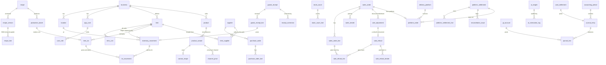

# Data Model

Source of truth: the SQL migrations in `supabase/migrations/` (51 tables after `0017`). This
document explains the design; the migrations are authoritative.

Conventions: every business table carries `business_id` for multi-tenant
isolation and RLS. Money and quantities are `NUMERIC` (exact). Timestamps are
`timestamptz` (UTC). Append-only tables are protected by triggers.

## Core relationships (selected)

```mermaid
erDiagram
  business ||--o{ location : has
  business ||--o{ app_user : has
  app_user ||--o{ user_role : holds
  business ||--o{ item : defines
  item ||--o{ item_unit : "alt units"
  business ||--o{ product : sells
  product ||--o{ product_variant : "sizes/flavours"
  product_variant ||--o| variant_recipe : uses
  recipe ||--o{ recipe_version : "versioned"
  recipe_version ||--o{ recipe_line : "BOM (channel-gated)"
  product_variant ||--o{ channel_price : "priced per channel"

  item ||--o{ inventory_movement : "ledger (append-only)"
  location ||--o{ inventory_movement : at
  item ||--o{ item_lot : "lot/expiry"
  production_batch ||--o| item_lot : "makes a lot"
  item_lot ||--o{ lot_movement : "gives and takes"
  inventory_movement ||--o{ lot_movement : "split by lot"

  supplier ||--o{ purchase_order : from
  item ||--o{ item_supplier : "bought from"
  supplier ||--o{ item_supplier : "sells, by the pack"
  purchase_order ||--o{ purchase_order_line : has
  goods_receipt ||--o{ goods_receipt_line : receives
  goods_receipt_line ||--o| inventory_movement : posts
  goods_receipt ||--o{ receipt_correction : "corrected by"
  recipe ||--o{ production_batch : produces
  stock_count ||--o{ stock_count_line : counts

  sales_order ||--o{ sales_order_line : has
  sales_order ||--o{ sales_tender : "paid by"
  sales_order ||--o{ sale_adjustment : "discount/void/refund"
  sale_adjustment ||--o| sale_refund : "a refund's document"
  sale_refund ||--o{ sale_refund_line : "gives back"
  sales_order_line ||--o{ sale_refund_line : "given back by"
  sale_refund ||--o{ sale_refund_tender : "paid back to"
  sales_order ||--o| platform_order : "from platform"

  delivery_platform ||--o{ platform_order : receives
  platform_settlement ||--o{ platform_settlement_line : lines
  platform_settlement ||--o{ reconciliation_issue : flags
  platform_settlement ||--o{ platform_order : "pays out"
  card_settlement ||--|| journal_entry : posts

  gl_account ||--o{ journal_line : posts
  journal_entry ||--o{ journal_line : balances
  accounting_period ||--o{ journal_entry : contains

  ai_insight ||--o{ ai_interaction_log : "audited by"
```

## Areas

### Organisation & security (`0001`)

`business` holds configurable currency/precision, timezone, locale, and the
negative-stock policy. `location` covers branches, warehouses, and the central
kitchen. `app_user` links to Supabase `auth.users` once the login's email is
confirmed (`0016`); its `pin_hash` column is unused. `user_role` grants roles
globally or per location. `audit_log` is append-only
(who/what/when/device/reason + before/after JSON).

### Catalog & recipes (`0002`)

`item` is anything stocked (ingredient, packaging, consumable, finished good,
resale) with **one immutable base unit**, plus flags (`returnable_to_stock`,
`track_lot`, `track_expiry`) and min/max/safety/par levels. `item_unit` defines
alternate purchase/consumption units with an exact `factor_to_base`.
`product`/`product_variant` are the sold units. `recipe` → `recipe_version`
(effective dates) → `recipe_line`; a line references an item or a sub-recipe,
carries a quantity+unit, and an optional `applies_to_channels` gate that encodes
channel-specific packaging. `channel_price` prices each variant per channel/
branch/period/promotion.

### Inventory, purchasing, production, counting (`0003`)

`inventory_movement` is **the ledger** — append-only, signed base-unit
quantities, optional cost snapshot, lot, reference, employee, reason, approval.
`current_stock` is a **view** summing it. `item_lot` tracks lot/expiry.
Purchasing: `supplier` → `purchase_order`(+lines) → `goods_receipt`(+lines,
landed-cost fields) → `purchase_invoice`; receipt lines link to their movement.
`production_batch` records planned/actual yield and consumed value (recorded
from `0023`, below).
`stock_count`(+lines) supports blind counts and links each approved line to its
adjustment movement.

### Sales (`0004`)

`sales_order` carries channel, status, monetary fields, a COGS snapshot, and a
**`UNIQUE(business_id, idempotency_key)`**, so a retried sale is recorded exactly
once; a trigger blocks deletes and freezes monetary amounts once finalized.
`sales_order_line`, `sales_tender`, `sale_adjustment` (discount/comp/void/refund
with reason + approver), `work_shift` (cash session variance), and `sync_log`
(sync auditing).

### Delivery platforms (`0005`)

`delivery_platform` + `platform_store_map`/`platform_product_map` map internal↔
external ids. `platform_order` stores **every economic component separately**
(list value, item/order/merchant/platform discounts, commission, fees, refunds,
adjustments, expected vs actual payout). `promotion` records the discount
sponsor. `platform_settlement`(+lines) and `reconciliation_issue` drive
reconciliation.

### Accounting (`0006`)

`gl_account` (configurable chart), `accounting_period` (open/locked),
`journal_entry` + `journal_line`. A **deferred constraint trigger** rejects any
unbalanced entry at commit; posting into a locked period is blocked. `expense`
and `expense_category` for operating costs.

### AI (`0007`)

`ai_insight` (recommendation + explanation + data used + confidence + horizon +
impact + status/approval) and append-only `ai_interaction_log` (provider, model,
prompt, response, approval) for a full audit trail. RLS enables tenant isolation
on every business table plus role/cost-visibility helper functions.

### Before the controls (`0008`–`0013`)

- **`stock_board`** (`0008`): a view of each item with its stock on hand, for
  the stock screens to read in one query.
- **The demo's public access** (`0009`–`0011`): reading, then reading and
  writing, the labelled demo business with the public key, and periods
  created and locked by the demo's AI accountant. All of it was closed by
  `0016`, which drops every policy and revokes every grant to the public key.
- **Books** (`0012`): a bill (`purchase_invoice`) gains its due date, what is
  paid on it, the delivery it bills and its journal; `supplier_payment` keeps
  what is paid against a bill; and 6300 Cash over/short takes the day's count.
- **The journal register** (`0013`): `journal_entry` gains its number
  (`journal_no`), a reference (`reference_no`), a `status` (draft or
  published) and a date to reverse on (`reverse_on`). A draft may be out of
  balance; nothing is published unless its debits equal its credits. The
  controls of `0014` number journals without gaps.

### Controls (`0014`–`0017`)

Added after the August 2026 audit; see [ADR 0002](adr/0002-database-posting-engine.md).

- **Journals.** `journal_entry` gains `status` (draft → published), a gapless
  `journal_no` from `document_counter`, a `period_id`, `reverses_entry`, and
  `legacy` for entries recorded before the controls. Lines can be written only
  while their entry is a draft; a published entry never changes.
- **Periods.** Monthly `accounting_period` rows in the business's own timezone,
  created on demand; a locked period refuses every posting.
- **Purchasing.** A receipt posts Dr Inventory / Cr **2050 Goods received not
  invoiced**; its bill clears 2050 and raises Accounts payable.
  `purchase_invoice` gains `cancelled_at`/`cancel_reason` (one-way, audited) and
  `legacy`.
- **Day close.** `work_shift.business_day`: one close per trading day per
  location (replaced by the drawer count of `0024`, below).
- **Counts.** `stock_count` records who counted and who approved; the expected
  quantities are never shown to the counter (since `0024`, each is the stock
  when the item is counted).
- **Tenancy.** Child tables carry `business_id`, so row-level security isolates
  them directly.
- **Access.** `role_permission` mirrors `src/domain/auth/permissions.ts`.
  Signed-in users read through row-level security and write only through the
  functions of `0015`.
- **Reports.** The functions of `0017` read published journal lines only:
  trial balance, P&L, and the reconciliation of each subledger with its
  control account.

### The till (`0018`)

- **Tables.** `dining_table` (name unique among a location's tables in use,
  area, seats, order, in use or not).
- **Bills paid later.** `pos_tab` is a bill for a table or a named customer:
  `open` → `paid` (linked to the one `sales_order` that `settle_tab` recorded
  through `record_sale`) or `cancelled`. It carries its trading day, who
  opened and closed it, when it was printed and how often, and a `version`
  bumped on every change, which every change must name. `pos_tab_line` holds
  its lines. A bill is never deleted; a paid or cancelled one never changes,
  and neither do its lines. An open bill is not a sale: it posts nothing.
- **Photos.** `product_image`: one PNG, JPEG or WebP per product, at most
  300 KB, checked by its first bytes. `product.image_url` carries a version, so
  a new photo is never hidden by a browser's copy of the old one.
- **Categories.** A category name is unique within the business; a hidden
  category takes its products off the till.

All four tables are readable by the business's members only and writable only
through the functions in `0018`.

### Discounts (`0019`, `0020`)

- A sale's `gross_amount`, `discount_amount` and `net_amount` now differ when a
  discount is given, and each `sales_order_line` carries its `line_discount`.
  The journal credits 4000 with the gross and debits 4100 with the discount.
- `pos_tab.discount_percent` or `pos_tab.discount_amount` (at most one): a
  bill's discount as the cashier gave it, worked out again as the bill
  changes, and applied when it is paid.
- `business.discount_round_to` (`0020`; 500 for a new business, 250 at the
  café): a percentage
  discount comes to the nearest multiple of it, exactly half-way up, and never
  more than the bill; an amount is taken as typed. `my_profile` passes it to
  the till, which shows the figure the books will record.

### Bill numbers (`0021`)

- `business.bill_prefix` (`SGC`): a bill entered without the supplier's own
  number takes `SGC-<year>-<nnnn>`, counted per year in `document_counter`
  (`bill:<year>`). `record_bill` takes the number while holding the counter's
  row lock, so two people are never given the same one; it passes over any
  number a bill already carries (from any supplier, cancelled or not), and
  refuses the café's form of number typed by hand. A supplier's own number
  stays unique per supplier, as before.
- `next_bill_number()` shows the bill form the next number without taking it.

### Production (`0023`)

- **Batch recipes** are `recipe` rows with an `output_item_id` (what they make),
  `batch_yield_base` and `batch_yield_unit` (how much a batch makes, and the unit
  the owner gave it in), `prep_instructions` and `is_active`. Their lines are
  items only, bought or made (never the item the recipe makes), in versions like
  a product's recipe. `save_batch_recipe` sets one up, creating the item it makes
  (type `finished_good`, in g, ml or pieces, with kg or L and any container such
  as a pan as further units) when it is new.
- **`production_batch`** gains `output_item_id`, `output_unit_code` (the unit
  what came out was given in) and `cancelled_at`, `cancelled_by`,
  `cancel_reason`. `record_production` (needs `production.record`) writes the
  batch and its movements in one transaction: `production_consumption` for each
  ingredient at its average cost and one `production_output` at their total, all
  referencing the batch. No journal: value stays in 1200. `cancel_production`
  (needs `inventory.adjust.approve`) reverses them (`reversal`,
  `production_cancel`), marks the batch cancelled and audits it.
- **`production.record`**: a new permission for owner, general manager, branch
  manager and barista. `production_recipes()` and `production_batches()` show
  recipes and batches to them; a batch's cost only to those who see costs.
- **A product's recipe changed from a date:** `change_product_recipe` (needs
  `recipe.edit`) starts a new version (today or later) and audits it;
  `new_recipe_version` now checks its lines the same way (items of the business,
  a quantity above zero). `menu_recipe_lines` names each line's item.

### Item costs (`0022`)

- `item_costs()` (needs `cost.view`): each active item's cost per base unit
  today, `item_issue_cost` at the default location, as `menu_costing` charges a
  serving. It is sent as text, so the product form receives every digit and
  prices a new recipe to the dinar the product's card will show. No table
  changes.

### Counts and the drawer (`0024`)

- **Counts.** `stock_count_line` gains `expected_at_count` (the ledger's
  quantity when the line was recorded, under the item's lock) and
  `counted_at`; neither is granted to signed-in users. Review and approval
  compare with `expected_at_count` (falling back to the opening snapshot for a
  line recorded before `0024`). `start_stock_count` refuses while another
  count at the location is being counted or waits for approval;
  `cancel_stock_count` (the counter or a manager, with a reason) marks it
  `rejected` with `Cancelled: …`, audited.
- **Accounts.** `1005 Cash in the safe` is added for every business; `1000` is
  named `Cash in the till` (a name the owner chose is kept). `1000` joins the
  accounts no manual journal may touch. `payment_account()` maps where money
  came from to its account: till 1000, safe 1005, card 1010, bank 1020, owner
  3000 (the old `cash` and `transfer` still mean the till and the bank). Since
  `0030` a card pays from the bank, 1020.
- **`cash_event`** — every movement of cash in and out of a location's drawer,
  signed (+ in, − out): `sale` (a cash tender, by trigger), `void` and `refund`
  (by trigger on `sale_adjustment`), `paid_out` and `paid_out_reversed`
  (expenses and bills paid from the till, and their reversals), `cash_in` and
  `cash_out` (cash moved). `work_shift_id` is set once, by the count that
  covers it, and never changes; nothing else about an event ever changes. As
  `0024` went in, `carry_cash_since_last_close()` (the migration's alone)
  carried every published movement of 1000 since each location's last day
  closed the old way into the drawer as its first events, so the first count
  expects the cash already taken.
- **`cash_transfer`** — cash moved between `till`, `safe`, `bank` and `owner`,
  with its journal; append-only. Takings sent to the safe or the bank after a
  count are one too, linked to the count.
- **`work_shift`** gains `kind` (`day` for the closes before `0024`, `drawer`
  after), `covers_from`, `left_in_drawer`, `taken_out` and `taken_to`. The
  one-close-per-day rule now applies to `day` closes only.
- **Functions.** `count_drawer` (needs `day.close`): counts everything since
  the last count at the location, posts the difference to 6300 and the takings
  to the safe or the bank, and audits `drawer.count`. `move_cash` (needs
  `day.close` or `accounting.post`; only the owner pays money out to the
  owner). `drawer_status` (what the drawer should hold now, and what moved
  since the last count). `record_expense` and `pay_bill` take where the money
  came from; paying from the till or the safe is refused beyond what the books
  say it holds. `close_day` has been closed since `0035`.
  `uncounted_days` lists the trading days whose cash no count has covered;
  `report_unclosed_days` and the period checklist use it.
- **Opening stock.** `record_opening_stock` (as `create_item`): an item with no
  stock history at a location is given its opening stock at the cost typed,
  Dr 1200 / Cr 3000, audited `inventory.opening`.

### The recipe and price in force, printed bills, uncosted sales (`0025`)

- **Recipes and prices.** `recipe_version_on(recipe, day)` is the version that
  started last on or before the day (`effective_from` desc, then `version_no`
  desc). `start_recipe_version` ends a new version the day before the next
  version already scheduled, and gives one starting the same day an empty
  range (`effective_to = effective_from − 1`), so it is kept but never used.
  `set_price` refuses a date before today and audits `price.set` (the price it
  replaces, and the new one). `menu_scheduled()` lists the prices and product
  recipes not yet in force; `cancel_scheduled_price` and
  `cancel_scheduled_recipe` (need `recipe.edit`, with a reason) delete one
  before it starts, audited `price.cancel` / `recipe.cancel` with what was
  deleted.
- **Printed bills.** `pos_tab_line` gains `unit_price`: set by
  `mark_bill_printed` from the price in force (for lines without one), kept by
  `save_tab` for the same product and by `split_tab` for a moved line.
  `pos_open_bills` shows a line at its `unit_price` when it has one.
  `post_sale` takes a bill's prices only from `settle_tab`
  (`p_trust_line_prices`); a sale at the counter is always at the price in
  force. `record_sale` and `settle_tab` take `p_expected_net`, the total the
  till showed: `assert_sale_total` refuses a new sale recorded at another
  total (a replay returns the original, unchecked).
- **Uncosted sales.** `product_variant` gains `no_stock_reason`: a product
  that uses no stock says why. `create_product` requires a recipe or the
  reason; `change_product_recipe` clears it; `set_no_stock` (needs
  `recipe.edit`) sets or clears it, audited `product.no_stock`.
  `uncosted_sales(business, from, to)` finds the sales costed at nothing, in
  whole or in part (a line with no cost and no reason, or an ingredient used
  at no value before it had any cost); `report_uncosted_sales` (needs
  `cost.view`) is the Reports list. `period_close_checklist` gains `blocks`:
  its new `uncosted` row is a warning (`blocks = false`), and `lock_period`
  refuses only on the rows that block.

### Reports that agree, and numbers that open (`0026`)

No table changes.

- `report_daily_sales` returns `refunds` (made that day against the channel's
  sales, whenever the sale) and `returned_cost` (what those refunds put back
  on the shelf) in place of `refunded`, so net sales are the P&L's.
- `dashboard_summary` leaves out the year-end close, as the P&L does.
- `report_journal_lines(from, to, accounts, exclude_year_end)` (needs
  `cost.view`, like the trial balance): the published lines, with the journal
  number, narration, source, account and who posted it, in a stable order the
  app reads in pages of 1,000.
- `stock_card(item, from, to)` (needs `cost.view`): an opening line (seq 0)
  then each movement, its kind (`stock_card_kind`, internal) and the quantity
  and value on hand after it.

### Master data: who changed what, delivery prices, items and suppliers (`0027`)

- **Who changed what.** The trigger `audit_change` (`audit_row_change`,
  internal) writes an `audit_log` row for every row added, changed or deleted
  in `product`, `product_variant`, `product_category`, `item`, `item_unit`,
  `supplier`, `business` and `location`: the action is `<table>.create`,
  `.update` or `.delete`; `before_state` and `after_state` hold only the columns
  that changed (the whole row when added or deleted); the person is whoever is
  signed in — none for a change made in SQL. A function may give a reason in
  the transaction's `audit.reason` setting (`update_item`, `update_supplier`,
  `cancel_scheduled_price` do). A change that changes nothing writes nothing.
- **Prices.** `channel_price.created_by` (the person signed in when it was
  set). The trigger `audit_price` (`audit_price_change`, internal) writes
  `price.set` for every price added — with the price in force it replaces —
  `price.update` for one changed in SQL, and `price.cancel` for one deleted,
  with the reason `cancel_scheduled_price` gives. `set_price` and
  `cancel_scheduled_price` no longer write their own rows.
- **What each sale was called.** `sales_order_line.product_name`, set when the
  line is written (`name_sale_line`, internal): "Product — Variant", or the
  product's name when they are the same. Lines written before `0027` have none,
  and are shown by the product's name now. `uncosted_sales` uses it.
- **Names unique among those in use.** The partial unique indexes
  `item_name_in_use`, `supplier_name_in_use` and `product_name_in_use` on
  `(business_id, name_key(name)) where is_active`. `name_key` ignores case,
  spaces and punctuation, never letters ("Dairy Co" and "Dairy co." are one
  name). `assert_name_free` (internal) says it in words first.
- **Opening stock is the owner's.** `record_opening_stock` gains `p_reason`
  and `create_item` gains `p_opening_reason`: opening stock needs the owner's
  role and a reason (`assert_owner_opening`, internal), which goes on the
  movement and the `inventory.opening` audit row.
- **Items, units and suppliers corrected** (`settings.manage`,
  `purchase.create` or `inventory.adjust.approve`; suppliers `purchase.create`):
  `update_item(item, name, type, name_ar, name_ckb, min_level, par_level,
is_active, reason)` — the base unit never changes; out of use only with no
  stock, no recipe in force or scheduled, no product selling it as bought and
  no batch recipe making it. `add_item_unit(item, code, label, factor)` — a
  code not already the item's (in any case), a positive size, 1,000 for a
  kilogram of grams or a litre of millilitres. `update_supplier(supplier, name,
contact, phone, is_active, reason)` — out of use only when owed nothing.
  `create_supplier`, `create_item`, `create_product` and `set_product_details`
  refuse a name in use.
- **Deliveries.** `receive_goods` gains `p_confirm`; a line may carry
  `unit_price` (times `qty`) in place of `goods_value`. A cost a base unit more
  than 25% from `item_reference_cost` (internal: the average cost where it is
  received, or the last delivery's cost) is refused unless confirmed, and a
  confirmation is audited `purchase.price_confirmed`. An item out of use, like
  a supplier out of use, receives nothing. `item_price_history(item)` (needs
  `cost.view`): its last 50 deliveries, with the supplier, what was paid and
  what it cost landed, a base unit.
- **Batch recipes** are audited: `save_batch_recipe` writes
  `recipe.batch.create` or `recipe.batch.change` with the recipe and its
  ingredients before and after (`recipe_lines_json`, internal). The older
  `new_recipe_version`, which changed a recipe without the audit trail, can no
  longer be called by anyone signed in.

### Exceptions: reasons, approvals and the report (`0028`)

- **Reasons.** `reason_code (kind, code, label, sort_order)`: the list a void,
  refund, discount or cancelled bill is given from (`kind` is `void`,
  `refund`, `discount` or `bill_cancel`); read by anyone signed in, changed
  only by a migration. `reason_text` (internal) turns a code and a note into
  what is kept: the label, and ": note" when there is one; "Other" (or a note
  with no code, as the screens before `0028` sent) is the note itself, which
  needs two words or more and six letters. Nothing chosen and nothing said is
  refused.
- **The cap.** `business.discount_cap_percent` (10; 0 to 100). A discount
  whose share of the bill (`discount_share`, internal: a percentage as asked,
  an amount as the part of the bill it takes off, to two places) is above it
  needs an approval, unless the person giving it holds the new permission
  `discount.approve` (owner, general manager, branch manager).
- **PINs.** `app_user.pin_hash` (bcrypt, through `extensions.crypt`), set by
  `set_my_pin(pin)` — for those holding `discount.approve`, `sale.void` or
  `sale.refund`; 4 to 8 digits, not one digit repeated nor a run — and
  audited `member.pin_set`. Nobody can read it. `my_profile` says only
  `has_pin`, and passes `discount_cap_percent` to the till.
- **Approvals.** `approval (kind discount|void|refund, approver_id,
requested_by, scope, expires_at, used_at, used_for)` and `pin_attempt
(approver_id, requested_by, ok, at)`, readable by no one signed in.
  `list_approvers(kind)` (needs `sale.create`): the names of the others who
  may approve it, with a PIN. `request_approval(kind, approver, pin, scope)`
  (needs `sale.create`): checks the PIN in a step of its own and keeps every
  attempt — a wrong one answers `{ok: false}` rather than failing, is audited
  `approval.refused`, and five in fifteen minutes lock that approver until
  they have passed; a right one makes an approval good for ten minutes,
  audited `approval.granted`. An approval is used once, for its kind, by the
  person who asked (`use_approval`, internal); a discount's covers the
  `scope.percent` asked, a void's or refund's the `scope.order_id`.
- **Discounts.** `record_sale`, `open_tab` and `save_tab` gain
  `p_discount_reason`, `p_discount_note` and `p_approval`. `sales_order` gains
  `discount_percent` (as asked), `discount_by`, `discount_approved_by` and
  `discount_reason`; `pos_tab` gains the last three, and a bill's discount,
  checked when it was put on the bill, is carried to its sale when it is paid
  (`post_sale` gains `p_discount`). An amount on a bill is checked again as the
  bill changes: taking things off cannot make it more of the bill than the cap
  or the approval allowed, except by a manager. `split_tab` carries a
  percentage's reason and approval to the new bill. `pos_open_bills` gains
  `discount_reason`, `discount_by` and `discount_approved_by` (names).
- **Voids and refunds.** `void_sale` and `refund_sale` take
  `(order, note, reason_code, approval)`; `sale_adjustment.reason_code` is
  kept, and `approved_by` is the second person when there was one, the
  requester otherwise.
- **Bills.** `save_tab` audits every reduction: `bill.reduce` once printed (a
  manager's call), `bill.line_remove` before; a change to a discount already
  on the bill is audited `bill.discount`. `cancel_tab(tab, version, note,
reason_code)`: a bill with items needs a manager and a reason from the list;
  `pos_tab.cancel_reason_code` is kept.
- **The report.** `report_exceptions(from, to)` (needs `audit.view`): every
  void, refund, discount, cancelled bill with items, line taken off a bill and
  wrong PIN in the dates, with the person, amount, reason, who approved it
  and whether it waits for review (a void or refund nobody else approved, a
  wrong PIN, a discount over the cap given before `0028`).

### Alerts and the daily brief (`0029`)

- **The rules.** `alert_conditions(business, at)` (internal, read-only): the
  audit's §7, version 1 — each row a `rule`, the `subject` it is about (an
  account, a location, an item, a product and channel, a bill, a person…), an
  `urgency` (`red` now, `orange` soon), a `title` saying what happened, `why`
  it matters, the `action` to take, a `confidence` (`high`, `medium`, `low`), a
  `link` to where to act, and its `facts` as JSON. The rules are
  `cash_negative`, `drawer_uncounted`, `count_stale`, `running_out`,
  `below_minimum`, `price_confirmed`, `no_recipe`, `no_cost`, `margin`,
  `waste_spike`, `exceptions_person`, `card_not_banked`,
  `platform_not_received`, `bill_due`, `price_typo` and `duplicate_payment`
  ([`CALCULATIONS.md`](CALCULATIONS.md) has each one's arithmetic).
- **The alerts kept.** `alert (rule, subject, urgency, title, why, action,
confidence, link, facts, first_seen_at, last_seen_at, resolved_at,
acknowledged_at, acknowledged_by, ack_note, snoozed_until, snoozed_by,
snooze_reason)`, readable by no one signed in: one open alert per business,
  rule and subject (`alert_open_one`). `refresh_alerts(business)` (internal,
  one at a time per business) opens an alert for each new condition, brings
  the open ones up to date, and resolves those whose condition has cleared;
  an alert that turns from orange to red loses its answer and its snooze. A
  condition that returns later opens a new alert. These rows are signals
  beside the books: nothing in the books is written from them.
- **Reading and answering.** `current_alerts()` (needs `profit.view`)
  refreshes, then lists the open alerts, red first, with who answered and a
  snooze only while it lasts. `acknowledge_alert(alert, note)` and
  `snooze_alert(alert, until, reason)` (need `sale.void` or
  `accounting.post`): a note or reason of three characters or more; a snooze
  until a day from tomorrow to 30 days ahead, lasting to the start of that day
  in the business's time; audited `alert.acknowledge` and `alert.snooze`.
  Nobody answers or snoozes an alert about their own exceptions.
- **The brief.** `daily_brief(day)` (needs `profit.view`; not a day to come)
  refreshes, then returns `facts` (sales, net sales from the ledger, voids,
  refunds and discounts with their amounts, waste, drawer counts and their
  difference, sales costed at nothing), `calculations` (cost of goods and its
  share of sales, gross profit and margin, the same weekday last week and the
  change since, the usual for the weekday — the four before with sales), the
  open `alerts` not snoozed with their `red` and `orange` counts, and the
  `recommendations`: the actions of red alerts nobody has answered.
- **Thresholds.** `business.alert_settings` (JSON, `{}` by default): the
  café's own thresholds; `alert_threshold_rules()` (internal) holds each one's
  default, limits and name, and `alert_setting(business, key)` (internal) the
  value in force. `alert_thresholds()` and `set_alert_thresholds(settings)`
  (need `settings.manage`): read them all, or change some — a number within
  the limits (a whole one for days, hours and counts), or empty to follow the
  default again; a change is on the audit trail as `business.update`.
- **Delivery times.** `supplier.lead_time_days` (0 to 30; empty: the café's
  default), set with `update_supplier`'s new `p_lead_time_days` and audited
  as `supplier.update`. Running out uses the item's last supplier's.
- **Clearing the test records.** `reset-test-data.sql` clears `alert`; the
  thresholds, with the business, are kept.

### Card and platform money (`0030`)

- **Accounts.** `6500 Card and bank fees` is added for every business.
  `payment_account('card')` is 1020: an expense or a bill paid by card comes
  out of the bank, so 1010 Card clearing holds only the till's card takings.
  `signed_line(code, amount)` (internal) makes a journal line from a signed
  amount: a debit when positive, a credit when negative.
- **`card_settlement`** `(covers_from, covers_to, till_total, terminal_total,
received, fee, difference, received_on, reference, note, journal_entry_id,
created_by, cancelled_at, cancelled_by, cancel_reason)`, readable by no one
  signed in: the card takings of a run of days. One in force per first day
  (`card_settlement_from`); a settlement starts the day after the last one in
  force. `fee` = the terminal's total − what reached the bank; `difference` =
  the till's card takings − the terminal's total.
- **`card_takings()`** (needs `cost.view`): the first day not yet settled
  (`from`), each day's card takings since (`days`: 1010 lines, less refunds
  and voids, leaving out the settlements' own journals and their reversals),
  1010's balance, and the last 30 settlements.
- **`record_card_settlement(through, terminal_total, received, received_on,
reference, note)`** (needs `accounting.post`): the days from `from` to
  `through`, a day that is over (not today); what reached the bank no more
  than the terminal's total; a note when the till and the terminal differ;
  the money arriving from `through` to today. Posts Dr 1020 received, Dr 6500
  fee, Dr or Cr 6300 the difference, Cr 1010 the till's takings; audited
  `card.settlement`. One at a time per business.
- **`cancel_card_settlement(settlement, reason)`** (needs `accounting.post`):
  the latest in force only, with a reason; its journal reversed, its days
  waiting again; audited `card.settlement_cancel`.
- **Platform order numbers.** `delivery_platform` has Talabat, Careem and
  Toters for every business (`platform_id_for(business, channel)`, internal,
  added a platform the first time it was sold through; dropped by `0031`, where
  a sale is refused unless the café has the platform). `record_sale` takes
  `p_platform_order_no`: a platform sale needs it — letters, digits and
  `# / _ . -`, at most 40 — and it is refused if that platform already has
  the number (ignoring case). The sale writes its `platform_order`
  (`external_order_id`, `store_list_value` = the sale's gross,
  `customer_payment` = its net, `import_source` = `till`), and the answer
  gives `platform_order_no`. A replay of the same sale is not asked again.
- **`platform_settlement`** gains `received_on`, `journal_entry_id`, `note`,
  `created_by`, `cancelled_at`, `cancelled_by`, `cancel_reason`; one in force
  per platform and reference, ignoring case
  (`platform_settlement_reference`). **`platform_settlement_line`** gains
  `reported_fees`, `status` (`matched`, `not_found`, `already_paid`,
  `voided`, `duplicate`), `sales_order_id` and `expected` (the sale's net).
- **`platform_money()`** (needs `cost.view`): the platforms, each order not
  yet paid out (not voided or refunded) with its number, sale, value and
  days waiting, their total (`waiting`), 1100's balance (`receivable`), the
  difference (`unmatched`), and the last 30 statements.
- **`match_platform_statement(platform, lines)`** (needs `cost.view`; writes
  nothing) over `platform_statement_match` (internal): each line
  `{order_no, payout, commission?, fees?}` matched to its platform order, or
  its status; with neither commission nor fees given, what the platform kept
  is its commission. `missing`: the orders waiting, sold no later than the
  latest matched one, that the statement leaves out. `totals` (the orders'
  value, payout, commission, fees, `difference` — value − payout − commission
  − fees — and `not_posted`, the payout on lines that match no order waiting)
  and the proposed `journal`: Dr 1020 payout, Dr 5100 commission, Dr 5200
  fees + difference, Cr 1100 the orders' value.
- **`post_platform_settlement(platform, reference, lines, received_on,
note)`** (needs `accounting.post`; one at a time per business): matches
  again, then needs a matched order, the statement's reference (once per
  platform), a note when any line is not a clean match, and the payout
  arriving from the latest order's day to today. Writes the settlement, its
  lines (the unmatched ones with why), a `reconciliation_issue` for each line
  not a clean match, marks the matched orders paid (`settlement_id`,
  `settlement_reference`, `settled_at`, `actual_payout`), and posts the
  proposed journal (`reference_type` `platform_settlement`); audited
  `platform.settlement` with the totals and `order_count`.
- **`cancel_platform_settlement(settlement, reason)`** (needs
  `accounting.post`): its journal reversed, its orders waiting again, the
  settlement kept and marked; audited `platform.settlement_cancel`.
- **The alerts.** `card_not_banked`: 1010's balance less the card takings of
  the last `card_days`, that is, takings older than that not yet settled.
  `platform_not_received`: for each platform, its orders waiting longer than
  `platform_days`, by number; and, as subject `unmatched`, 1100 that no order
  waiting explains.
- **Clearing the test records.** `reset-test-data.sql` clears
  `card_settlement` with the platform orders and settlements; the delivery
  platforms, with the business, are kept.

### Delivery platforms the café adds (`0031`)

- **`delivery_platform`** gains `names` (jsonb, its name in other languages by
  code: `{"ar": "…", "ckb": "…"}`), `sort_order` and `created_at`, and checks
  that `code` is small Latin letters, digits and `_` starting with a letter
  (`delivery_platform_code_format`) and that `names` is an object. The
  migration names Talabat, Careem and Toters in Arabic and Kurdish, and takes
  Careem and Toters out of use where they were never priced or sold through
  (the till offered Talabat only).
- **Every channel but `dine_in`, `takeaway` and `direct_delivery` is a
  platform** (`is_platform_channel`). A platform's code is a value of
  `sales_channel`: `add_delivery_platform` adds it to the type, so every
  table that keeps a channel (`channel_price`, `recipe_line`, `sales_order`,
  `pos_tab`) takes it unchanged. A value added to a type can be used once the
  transaction adding it is over, so a platform is set up by a second call.
- **`sales_channels()`** (any member): `code`, `name`, `names`, `kind`
  (`dine_in`, `takeaway`, `delivery`, `platform`), `is_active` and
  `sort_order`, the shop's three first, then the café's platforms by
  `sort_order` and name. The till, the menu, the reports and the audit trail
  read their channels, and each channel's name in the reader's language, from
  it.
- **`add_delivery_platform(name, code, names)`** (needs `settings.manage`; one
  at a time per business): a name used once, ignoring case, up to 60 letters;
  the code, if not given, made from a name in Latin letters, else
  `platform_1`, `platform_2`…; not one of the shop's three nor a code the café
  has. Adds the code to `sales_channel`, the platform last in order, in use;
  audited `platform.create`.
- **`copy_platform_setup(platform, like, prices)`** (needs
  `settings.manage`; a platform in use): every recipe line gated to the
  channel it works like is gated to the platform too, in every version of
  every recipe (no recorded sale changes: none was on the platform); with
  `prices`, each active product priced on that channel today, and not on the
  platform, is priced the same there from today (`audit.reason` "Priced as on
  … when … was added"). Returns `{lines, prices}`; audited `platform.setup`
  when it copied anything.
- **`update_delivery_platform(platform, name, names, active)`** (needs
  `settings.manage`): renamed, named in other languages, taken out of use or
  brought back; audited `platform.update` with what it was and is, when
  anything changed.
- **A platform out of use** sells nothing more: `record_sale` refuses it ("…
  is no longer in use: bring it back on Delivery Platforms to sell through
  it"), except a replay of a sale it already recorded. It raises no margin or
  price alerts (`channel_in_use`, internal), and the till offers it no more.
  What it owes and its statements stay: `platform_money()` lists every
  platform, with `names`, `active`, `waiting` (its orders waiting) and
  `priced` (products on the menu with a price on it today).
- **The alerts** name a platform as the café named it
  (`alert_channel(business, channel)`, internal; the one-argument version is
  dropped). A price that looks mistyped names the dearest channel, and the
  first in order when two charge the same.

### Languages the café adds, and its own words (`0032`)

- **`app_language`**: a language the café adds beside the built-in English,
  Arabic and Kurdish (never one of those three): its `code` (two or three
  small Latin letters, a region after a dash if needed: `tr`, `fa`, `kmr`,
  `pt-br`), its `name` as its speakers write it (up to 40 letters), `dir`
  (`ltr` or `rtl`), `is_active`, and who added it and when.
- **`app_phrase`**: the café's own words for a phrase in a language, a
  built-in one too: `locale`, `phrase` (kept by its English, or a dotted key
  such as `pos.title`), `words` (keeping every `{placeholder}` the English
  has), and who changed them last and when. A phrase with no words in a
  language shows its English.
- Nothing reads either table directly (row-level security forced, with no
  policy):
  - **`app_words(locale)`** (any member): the café's languages in use, and
    the reader's language's words;
  - **`language_settings()`** (needs `settings.manage`): every language
    added, in use or not, and how many phrases have the café's own words in
    each language;
  - **`save_language(code, name, dir, active)`** (needs `settings.manage`):
    adds a language, renames it, takes it out of use or brings it back,
    audited `language.add` or `language.update`;
  - **`save_phrases(locale, phrases)`** (needs `settings.manage`): gives or
    clears the café's words, at most 5,000 phrases at a time, audited
    `language.words`.
- Clearing the test records keeps both.

### A new item from its delivery (`0033`)

- **`create_item`** checks its pack units by the rule `add_item_unit` keeps
  (`assert_unit_ok`, internal): a pack has a name of its own, not the base
  unit's; it holds something; a kilogram is 1000 grams and a litre 1000 ml;
  and no two packs of one item share a name. A reorder level is not
  negative.
- Who may add an item is unchanged: the owner and managers, and whoever does
  the purchasing (`purchase.create`). An item added on a receipt has no
  opening stock: its stock comes in with the delivery. The same name,
  whatever its capitals, spaces or punctuation, is still refused (`0027`).

### Turn numbers (`0034`)

- **`sales_order.turn_no` and `pos_tab.turn_no`**: the order's number for
  the day, printed on the customer's receipt and the barista's ticket and
  called out when the order is ready. Null on orders from before `0034`.
- **Taken from `document_counter`**, one counter a day (`turn:YYYY-MM-DD`,
  the business's own day, from 1), by `take_turn_no(business, day)`
  (internal), in the transaction of the order it numbers: an order refused
  takes none and no number is skipped, and two tills never take the same one.
- **A bill** takes its number as it is inserted (trigger `pos_tab_turn_no`,
  whatever opens it); the part `split_tab` splits off keeps it. **A sale**
  takes its number in `post_sale` (now given `p_turn_no`), written as the
  sale is completed, since a finalized sale never changes (`0014`): a quick
  sale takes the day's next number; `settle_tab` passes the bill's, and a bill
  from before `0034` takes one then. `record_sale`, `settle_tab` (and their
  replays) return `turn_no`; `pos_open_bills()` gives each bill's.

### Every write recorded once (`0035`)

- **`request_log`** (`business_id`, `key`, `operation`, `request_hash`,
  `result`, `app_user_id`, `created_at`; primary key `(business_id, key)`):
  the answer each keyed write gave, stored in the same transaction as the
  work. Row security is forced and nothing is granted on it: only the
  database's own functions read or write it.
- **`idem_begin(business, key, operation, args)`** (internal) takes an
  advisory lock on the key, then answers a retry with the stored answer
  (marked `replayed`), refuses a key used for another operation, other
  arguments or by another person, and otherwise lets the work proceed;
  **`idem_finish`** stores the answer. Each of the fifty writes keeps its name
  and parameters, with `p_idempotency_key uuid` last; the work itself is
  `<name>__run`, callable only by the database.
- **Keys from the API (`0036`).** A keyed write called through the API
  (PostgREST sets `request.path` to `/rpc/<name>`) without a key is refused:
  _"This screen sent no retry key: reload the page and try again"_. Only the
  function the API called is held to it, so the writes it makes inside (a
  bill opened with its first order saves it) are not; SQL callers, which set
  no `request.path`, are not affected.

### The drawer in sessions (`0036`)

- **`cash_drawer`** (`location_id`, `name` "Till", `is_active`): one active
  drawer per location (unique index `cash_drawer_one_per_location`), made for
  every location as `0036` went in and for each new one by trigger
  (`location_drawer`). Members read it; nobody writes it but the database.
- **`work_shift`** gains `kind = 'session'` beside `day` and `drawer`, with
  `drawer_id`, `session_no` (numbered per business from `document_counter`,
  `session`), `cashier_id`, `opening_counted`, `opening_expected` (what the
  last session or count left), `opening_variance`, `opening_denominations`
  and `closing_denominations` (the notes counted, `{"1000": 2}`), `closed_by`,
  `forced_reason` (a manager's close) and `opened_from` (the session handed
  over to this one, or the drawer record its first opening took over). A
  session's `expected_cash` is its opening count and every movement in it.
  One session is open per drawer (unique index `work_shift_one_open_session`);
  a closed one never changes (the guard of `0014`). `open_session_at(business,
location)` gives the open one.
- **Cash joins the open session.** A `cash_event` is given its session as it
  is inserted (trigger `cash_event_session`, which takes the session in share
  mode, so a close waits for cash already on its way in); with no session
  open it is refused: _"Open the drawer first: on the till, count the cash in
  it"_. An open session's events are read only with `cash.view_expected`.
- **`sales_order.shift_id`** names the session open when the sale was made
  (trigger `sales_order_session`), now a foreign key to `work_shift`; a
  session's card takings and orders come from it.
- **Journals.** A difference at the opening posts to 6300 with reference
  `session_opening` (the session's id), one at the close with reference
  `work_shift`; each source is posted once (`journal_entry_one_per_source`).
  The takings after a close are a `cash_transfer` from the till to the safe or
  the bank; a float at the opening is one from the safe (Dr 1000, Cr 1005).
- **The first opening takes over.** When a drawer's first session opens and
  cash has moved since its last count (or the location has only days closed
  the old way), a closed `drawer` record is written first: what the last
  count left and every movement since, or, for a drawer never counted, what
  the books say the till holds (1000, less the cash other locations' drawers
  are known to hold). The session opens on the count against it.
- **Functions** (each keyed, audited `cash.session.open`, `.close`,
  `.hand_over`, `.force_close`): `open_cash_session` (`cash.session`; a float
  from the safe needs `day.close` or `accounting.post`),
  `close_cash_session` (the session's cashier, or `cash.session.force`),
  `hand_over_session` (close and open the next person's, in one step) and
  `force_close_session` (`cash.session.force`, a reason, counted or not).
  `cash_session_status` (the till's view: what an open drawer should hold
  only with `cash.view_expected`), `cash_sessions(from, to)` (sessions and the
  drawer counts and day closes before them) and `cash_session_statement`
  (every movement of a session's cash; an open one's only with
  `cash.view_expected`). `drawer_position`, `assert_drawer_can_pay`,
  `uncounted_days`, the void rule, the alerts and the daily brief know
  sessions. `count_drawer` closed the open session until `0037` withdrew it;
  `drawer_status` shows cash figures only with `cash.view_expected`.
- **Permissions.** `cash.session` (owner, general manager, branch manager,
  cashier, barista), `cash.view_expected` (owner, general manager,
  accountant, auditor), `cash.session.force` (owner, general manager, branch
  manager).

### Refunds by the item (`0037`)

- **`inventory_movement.sales_order_line_id`** names the sale's line that took
  the stock, written by `post_sale` for every sale since `0037` (not a foreign
  key: the line is written after the movements that cost it; the test suite
  checks every one names a line of its own sale). A sale whose
  `sale_consumption` movements name no line was recorded before, and is
  refunded whole.
- **`sale_refund`** (`id` = the `sale_adjustment` of kind `refund` it is,
  `refund_no` numbered per business from `document_counter`, `refund`,
  `sales_order_id`, `location_id`, `work_shift_id` (the drawer's session open
  when it was made), `amount`, `cost_returned`, `reason_code`, `reason`,
  `requested_by`, `approved_by`, `approval_id`, `journal_entry_id`, `whole`
  (it took all that was left of the sale), `created_at`): the refund as a
  document. Because it is also the sale's adjustment, with the same id, the
  drawer (a cash refund's `cash_event`), the reports, the exceptions and the
  daily brief read it as before.
- **`sale_refund_line`** (`refund_id`, `sales_order_line_id`, `qty`, `amount`,
  `cost_returned`, `restocked`; one per line of a refund) and
  **`sale_refund_tender`** (`refund_id`, `tender_type`, `amount`): what each
  refund gave back and where the money went (each way the sale was paid, since
  `0042`).
- The three are append-only (`forbid_mutation`), row security forced, and read
  only with `cost.view`, like the sale they belong to.
- **`refund_sale_lines(order, lines, reason_code, reason, approval, key)`**
  (`sale.refund`, keyed): `lines` is `[{"line_id", "qty"}]`. It refuses a line
  not on the sale or named twice, more than is left of a line, and a refund of
  nothing; then writes the adjustment (a cash refund's `cash_event` joins the
  open session, or is refused with none open), the refund, its lines, its
  tender, the stock back on the shelf (`refund_return_to_stock`, reference
  `sale_refund`, naming the line) and its journal (reference `sale_refund`),
  and moves the sale to `partially_refunded` or `refunded`. Audited
  `sale.refund` with the refund's number, what it gave back, the items, the
  cost returned, who approved it and the sale's status before and after.
- **`refund_sale`** (`0028`, keyed since `0035`) now refunds all that is left
  of a sale through the same work (`refund_lines_internal`), so a sale
  part-refunded can be refunded whole.
- **`sale_refunded(order)`** is what every refund of a sale has given back,
  before `0037` too. `platform_money` and the statement match read an order's
  net less it, so a platform is owed what is left of an order part-refunded.
- **`count_drawer`**, kept through the deploy of `0036`, can no longer be
  called.

### Delivery corrections, and the books checked account by account (`0038`)

- **Movement types `receipt_correction` and `cost_adjustment`.** A
  correction's change in quantity is a `receipt_correction` movement (in or
  out); a change in price revalues the stock still on the shelf as a pair of
  `cost_adjustment` movements, the stock out at its value and back in at the
  corrected one, so the quantity never moves and the value does. Both carry
  the reference `receipt_correction` and the correction's id. On the stock
  card the first reads as received, the second as revalued.
- **`receipt_correction`** (`correction_no` numbered per business from
  `document_counter`, `goods_receipt_id`, `kinds` (quantity, price, item,
  supplier, date, reversed), `reason`, `before_state` and `after_state` (the
  delivery's supplier, day, freight, other costs, rebate and lines, each line
  with its item, quantity, unit, base quantity, goods value and landed cost),
  `effects` (per item: the quantity and value before and after, what was on
  hand, how much of the delivery's value was still on it, the change to
  stock, to GRNI and to price variance, and the movements), `journal_entry_id`,
  `created_by`, `created_at`): a correction as a document. Append-only
  (`forbid_mutation`), row security forced, read with `cost.view`. What was
  received first stays as it was: `goods_receipt_line` is never changed.
- **`receipt_state(receipt)`** is the delivery as it stands: its latest
  correction's `after_state`, or `receipt_original_state` as received.
  `receipt_grni_value(receipt)` and `receipt_grni_value_at(receipt, at)` add
  the corrections' 2050 to what the receipt credited. The bill, the price
  history (`item_price_history`) and an item's reference cost
  (`item_reference_cost`) read the delivery as it stands; `record_bill`
  refuses a reversed delivery and checks the supplier it has now.
- **`preview_receipt_correction(receipt, lines, supplier, received_on,
reverse)`** (`inventory.adjust.approve`) says, writing nothing, what a
  correction would do and why it cannot be made (`blocked`).
  **`correct_receipt(receipt, lines, supplier, received_on, reason, confirm,
key)`** and **`reverse_receipt(receipt, reason, confirm, key)`**
  (`inventory.adjust.approve`, keyed) make it: `lines` is `[{"line_id",
"item_id", "qty", "unit_code", "unit_price" | "goods_value"}]`, a line
  without `line_id` is added and one left out is taken off. Audited
  `purchase.correct` or `purchase.reverse` with the delivery's lines, supplier
  and day before and after, and what the correction changed.
- **`reconciliation_checks(business, as_of)`** (behind `report_reconciliation`,
  `cost.view`) gains `card` (1010), `platform` (1100), `drawer` (1000), `safe`
  (1005) and `documents`; `drawer_position_at(business, location, at)` is what
  a drawer should have held at a moment, if it is known;
  `document_problems(business, before)` (behind
  `report_document_problems(as_of)`, `cost.view`) lists each record without
  its one journal and each automatic journal without its record.
  `period_close_checklist` blocks on all nine.
- **`manual_journal_blocked`** adds 1005: the safe's cash moves only as cash
  moved, an expense or a bill paid.

### Usage against the recipes (`0039`)

Nothing new is stored: the report reads the counts and the stock ledger.

- **`usage_variance_between(business, location, item, first line, last
line)`** (internal) works out one item between two lines of approved counts:
  the ledger's movements recorded after the first was counted and up to the
  last, split by `stock_card_kind` into what came in, what the recipes used
  (sales net of voids and refunds, and batches), what was lost by kind; what
  the counts set, and revaluations, left out. It gives the used quantity, the
  difference, its share and value, the products whose sale lines took it
  (named on the movements since `0037`, voided sales left out), the batches,
  and what may explain the difference.
- **`report_usage_variance(from, to, location)`** (`cost.view`): each item
  between its first and last approved count in the dates, at the location
  (the default one when none is given); an item counted once is listed with
  `counts = 1` and nothing else.
- **Alerts:** `alert_conditions` becomes `alert_conditions_0036` and the new
  one adds `usage_variance`; `alert_threshold_rules` adds
  `usage_variance_percent` (10) and `usage_variance_min` (5,000 IQD).

### Business rules, stock below zero, losses added up (`0040`)

- **`business_rule`**: `key`, `scope_type` (`business`, `role`, `location`,
  `item_type`, `item`), `scope_id` (empty for the café; a role, a kind of
  item, or an item's or a branch's id), `value` (jsonb; null: back to the
  default), `reason` (required), `set_by`, `set_at`; one row per key and
  scope. Never deleted; read with `settings.manage`.
- **`business_rule_history`**: every change, `old_value` → `new_value`, with
  the reason, who and when; written by the rule's own trigger, append-only.
- **`loss_review`**: one per loss looked at by a manager: `decision`
  (`approved`, `reversed`), `reason`, `decided_by`, and for a reversal the
  movement that put the stock back and the journal that reversed the loss's.
  Append-only; read with `waste.approve`. A loss waiting is a movement with
  `approval_status = 'pending'` and no review.
- **`rule_definitions()`**: each rule, its kind (percent, amount, choice), its
  limits or choices, and the scopes it may be set for:
  `discount_cap_percent` and `refund_approval_over` and `waste_approval_over`
  (café, role), `discount_round_to` and `waste_approval_window` (café),
  `negative_stock` (café, kind of item, item). **`rule_defaults(business)`**:
  the business row's old columns (`discount_cap_percent`, `discount_round_to`,
  `waste_approval_threshold`, and `prevent_negative_stock` as `block` or
  `alert`), 25,000 for refunds, `session` for the window, and `block` for
  finished goods and sub-recipes. **`rule_value(business, key, item, roles,
location)`**: the item's own row, its kind's, the location's, the most any
  of the roles allows, the café's; **`member_rule_number`**: a number rule
  through a person's roles.
- **`set_business_rule(key, scope_type, scope_id, value, reason, key)`**
  (`settings.manage`, keyed): checks the rule, the scope and the value (`allow`
  only for an item), writes the row and the audit event `rule.set`;
  **`list_business_rules()`**: the definitions, every row as it stands (set or
  default, with who, when and why) and the last 200 changes.
- **Stock below zero:** `stock_shortfalls(business, location, needs)` and
  `stock_rules(…)`, called under the items' locks by `post_sale` (so by
  `record_sale` and `settle_tab`, which take `p_stock_approval`),
  `record_waste`, `record_production` (`p_stock_approval`), `adjust_stock` and
  `correct_receipt`. An approval is used once (`use_approval`) and the audit
  event `stock.below_zero` keeps what and who.
- **Losses:** `record_waste(…, p_approval, p_wait)` adds up the person's losses
  over the window and the item's over the day (`losses_since`, reversed ones
  left out), under a lock per person; **`review_loss(movement, approve |
reverse, reason, key)`** (`waste.approve`, not the recorder);
  **`losses_waiting()`** (`waste.approve`).
- **Approvals:** `approval.kind` adds `waste` (approved with `waste.approve`)
  and `negative_stock` (`inventory.adjust.approve`); those who record losses
  or batches may ask for one.
- **Also changed:** `discount_approver`, `save_tab`, `report_exceptions` read
  the giver's cap; `sale_discount` the step; `refund_lines_internal` refuses a
  refund over the refunder's limit without a second person; `my_profile` gives
  the person's cap, refund and loss limits and the window; `stock_card_kind`
  names a loss reversed a loss taken back.
- **Alerts:** `alert_conditions` becomes `alert_conditions_0039`, and the new
  one adds `stock_below_zero` and `losses_waiting`.

### Sizes and add-ons (`0041`)

A size is a `product_variant`, as it always was; nothing about sizes is new
in the tables. The add-ons are:

- **`modifier_group`**: a group of choices (Milk, Extras, Toppings), its name
  in the three languages, `min_select` (0–20: 1 or more makes the till ask
  for it) and `max_select` (1–20, no fewer than the fewest; empty for no
  limit), `sort_order`, `is_active`. One group in use per name
  (`name_key`).
- **`modifier`**: an add-on in a group, its names, `sort_order`, `is_active`;
  one in use per name in its group. It stays in its group.
- **`modifier_price`**: an add-on's price on a channel (`location_id` empty
  for every place), 0 or more, from `effective_from`; the newest row in force
  on the day wins, as `channel_price` does. A channel with no row does not
  offer the add-on.
- **`modifier_recipe_line`**: what one of the add-on uses (item, quantity,
  unit, channels), for every size (`product_variant_id` empty) or one size's
  own, which then replace those for every size. Read with `cost.view`.
- **`product_modifier_group`**: the groups a product offers, for every size
  (`product_variant_id` empty) or for the sizes named; a group once per
  product for every size, or once per size.
- **`pos_tab_line_modifier`**: a bill line's add-ons, how many for each one of
  the line (1–20), and their price once the bill is printed; deleted with its
  line.
- **`sales_order_line_modifier`**: an add-on as it was sold: its group, its
  name then, how many in all (per one × the line's quantity), its price, its
  amount, its share of the line's discount (`net_amount`), what it cost, and
  its place on the line. Append-only; read with `cost.view`.
- Groups and add-ons are audited by row (`modifier_group.*`, `modifier.*`);
  prices by `modifier_price.set` (was and now), recipes by `modifier.recipe`
  (before and after, for every size or the size named), the groups a product
  offers by `product.modifiers`. Writes go through the functions only.
- **Sizes:** `add_variant(product, name, prices, recipe, copy_from,
no_stock_reason, name_ar, name_ckb, rename_existing, key)` (`recipe.edit`,
  keyed) adds a size with its prices and exactly one of: its own recipe, the
  recipe another of the product's sizes has in force today, or why it uses
  no stock; `rename_existing` names the product's one size in the same step
  (Latte becomes Regular). A name is the product's once, retired sizes
  included; a product sold as bought takes no second size. It writes
  `recipe.change`. `update_variant(variant, name, name_ar, name_ckb, key)`
  renames; `retire_variant(variant, retire, reason, key)` takes a size off
  the till with a reason (not the last on sale, not while on an open bill) or
  brings it back; the reason is kept on `product_variant.update`.
- **Add-ons:** `save_modifier_group(…)` and `save_modifier(…)` (a new add-on
  with its first prices and recipe; neither taken off the till while on an
  open bill),
  `set_modifier_price(modifier, channel, price, from, key)` (not before
  today), `set_modifier_recipe(modifier, variant, lines, key)` and
  `set_product_modifiers(product, [{group_id, variant_id}], key)` (a group in
  use; one already offered may stay when it is taken off the till; one whose
  add-ons are on an open bill of the product stays). All `recipe.edit`,
  keyed. `pos_addons()` (`sale.create`) gives the till the groups in use,
  their add-ons with today's prices, and which products and sizes offer them
  — never their cost.
- **Selling:** `post_sale` keeps its signature: each line may carry
  `modifiers` ([{modifier_id, qty, price?}]), read by `line_modifiers` (known,
  in use, offered with the size, once each, 1–20, priced on the channel, and
  every group of the size given its fewest and no more than its most, in
  order). `expand_modifier(modifier, variant, channel, qty)` gives what they
  use, locked and checked with the line's own items. `save_tab`,
  `split_tab`, `mark_bill_printed`, `settle_tab` and `pos_open_bills` carry a
  line's add-ons, frozen at the printed price by add-on.
- **`report_sizes_and_addons(from, to)`** (`cost.view`): each size sold (its
  quantity, lines, sales and cost less its add-ons), and each add-on (how many,
  on how many lines, its sales, cost and margin, and the lines of the products
  offering its group today). Voided sales left out; refunds not taken off.

### Split payments (`0042`)

- **`sales_tender`** gains `received` (the cash handed over for a cash
  payment, when typed: at least its `amount`, and only for cash),
  `change_given` (worked out: `received − amount`) and `position` (the order
  it was taken in). `amount` stays what the payment pays of the sale; a
  sale's payments come to its net exactly. Indexed by sale.
- **`post_sale`, `record_sale` and `settle_tab`** take `p_tenders`
  (`[{type, amount, received}]`), read by `sale_payments`: cash or card in the
  café, platform-paid once for a platform's order, ten at most, each more than
  nothing (a sale that comes to nothing takes one of nothing), in whole units;
  `received` only for cash. `p_tender` stays for a till loaded before; one or
  the other, not both. The total the till showed (`p_expected_net`) is
  checked first, then the payments. Each payment is a row, each cash one a
  drawer event (`trg_cash_from_tender`), and the journal debits each account
  its parts. The answer lists the payments (`order_payments`), a replay too.
- **Voids:** `trg_cash_from_adjustment` takes back the sale's cash drawer
  events, and no longer handles refunds.
- **Refunds:** `refundable_payments(order)` gives what is left of each way a
  sale was paid (a refund from before `0037` taken off its one payment).
  `refund_lines_internal` and `refund_sale_lines(order, lines, reason_code,
reason, approval, tenders, key)` take `p_tenders` (`[{type, amount}]`, each
  way once, each at most what is left of it, together the refund) or share
  the refund in proportion (`allocate_landed`). One `sale_refund_tender` per
  way; the journal credits each way's account; a cash part is a drawer event
  by `trg_cash_from_refund_tender`, which checks the drawer holds it. A
  request sent without `p_tenders` is keyed as before.
- **Figures:** `day_cash_totals` counts each refund's cash part (a refund from
  before `0037`: all of it, when the sale was paid in cash); `drawer_status`
  counts a sale paid two ways once.
- **`report_payments(from, to)`** (`cost.view`): each way of paying, for the
  sales placed in the dates (voids left out): how many it paid for, how many
  of those were paid another way too, what it took, the change cash gave;
  what refunds made in the dates gave back that way; the net.

### US dollars (`0043`)

- **Accounts:** 1001 Cash in the till — USD and 1006 Cash in the safe — USD
  (assets, in dinars at what the dollars were taken at), 6950 Exchange
  differences (expense, either way). Provisioned for every café; no manual
  journal to 1001 or 1006 (`manual_journal_blocked`).
- **Rules:** `usd_rate_max_age_hours` (1–168, default 36: an older rate takes
  no dollars) and `usd_round_to` (1–100,000, default 250: dollars' value in
  dinars, to the nearest).
- **`fx_rate`** (`currency` 'USD', `rate` whole dinars a dollar, 100–100,000,
  `effective_from`, `set_by`, `reason`): append-only, read by the café's
  members; the latest is the rate. `set_fx_rate(currency, rate, reason, key)`
  (`fx.rate`: owner, general manager, branch manager; keyed; `fx.rate.set` on
  the audit trail with the rate before). `fx_status()` (anyone at the till or
  in the office): the rate, when, by whom and why, its age, the rules, whether
  dollars are taken at it, whether the reader may set it, and the last 30.
  `usd_rate_now(business)` refuses when there is none or it is too old;
  `usd_value(business, usd, rate)` values dollars to the step.
- **`sales_tender`** gains `currency` ('IQD' | 'USD'), `foreign_amount` (whole
  dollars) and `rate`. A payment in dollars is cash; `received` is what the
  dollars are worth, `amount` its part of the sale, `change_given` the change,
  in dinars. `sale_payments` reads `{type: 'cash', currency: 'USD', usd, rate,
amount}`; `sale_dollars` prices them once the sale is (after a retry is
  recognised): at the rate now, which must be the rate sent, worth at least
  their part. The journal nets each account: 1001 debited their value, 1000
  credited the change. `order_payments` gives the dollars and the rate.
- **`fx_cash_event`** (`place` 'till' | 'safe', `kind` sale | void | count |
  take | exchange, `usd` signed whole dollars, `value` signed dinars, `rate`,
  the record it comes from, `work_shift_id`): the dollars' own drawer, never
  changed. A till's event needs the open session, or names the session a
  close counts (`trg_fx_cash_event_session`). A sale's dollars go in by
  `trg_cash_from_tender`, with the change out of the dinar drawer, which must
  hold it; a void takes them out (`trg_cash_from_adjustment`), refused once
  the till no longer holds them. `fx_place_balance(business, place, location)`
  gives what a till (per branch) or the safe (the café's) holds and its value;
  dollars leaving take their share of it (`fx_value_out`), the last of them
  the rest. Moved one at a time (`lock_dollars`).
- **`session_dollar_count`** (one per session that held dollars: `expected`,
  `counted` — null when not counted —, `variance`, `variance_value`, `taken`,
  `taken_value`, `denominations`, `journal_entry_id`): the dollars counted at a
  close, by `close_session_dollars`, after the dinars. All counted go to the
  safe (take events till − / safe +); one journal, reference
  `session_dollars`, for the difference (6300) and the take (1006 / 1001).
  `close_cash_session`, `hand_over_session` and `force_close_session` take
  `p_usd_counted` and `p_usd_denominations` before the key, keyed only when
  sent; the answer and the audit trail give the dollars, or `usd_carried`.
  `cash_session_status` says whether the till holds dollars (how many only to
  those who see what it should hold); `cash_session_statement` gives the
  count and the till's dollar events.
- **`fx_exchange`** (`from_place` till | safe, `to_place` till | safe | bank,
  `usd`, `value` — what they were taken at —, `received`, `difference`
  worked out, `note`, `journal_entry_id`): by `exchange_dollars(from, usd,
received, to, note, location, key)` (`day.close` or `accounting.post`;
  keyed): the dinars into the till (a drawer event), the safe (1005) or the
  bank (1020), the dollars out of 1001 or 1006 at their value, the difference
  to 6950; `fx.exchange` on the audit trail. Append-only, read with
  `cost.view`.
- **`report_dollars(from, to)`** (`cost.view`): the dollars taken (sales, usd,
  value, what they paid, the change), by rate, the rates set, the exchanges,
  the counts, the differences (6950 and 6300), and what the tills and the
  safe hold now.
- **The books:** `reconciliation_checks` gains `dollars` (every dollar event's
  value against 1001 + 1006); the safe's check takes the dinars exchanged into
  it. `document_problems` flags a close's dollars or an exchange with no
  journal, and journals `session_dollars` or `fx_exchange` without their
  record.

### Purchasing: orders, returns and credits (`0044`)

- **Rule and permission:** `po_approve_up_to` (amount, 0–1,000,000,000, by the
  café or a role; the café 250,000, the owner and the general manager
  1,000,000,000) and `purchase.approve` (owner, general manager, branch
  manager).
- **`purchase_order`** (empty on every database before `0044`, which refuses
  to run otherwise): `status` is text, `draft` | `approved` | `sent` | `closed`
  | `cancelled` (the `po_status` type is dropped); `po_no` (the café's
  `purchase_order` number), `expected_on` (a day; `expected_at` dropped),
  `total` (each line to the dinar, added up), `approved_by/at`, `sent_by/at`,
  `closed_by/at`, `close_reason`, `cancelled_by/at`, `cancel_reason` (needed),
  `updated_at`; `purchase_order_steps` holds each status to its dates.
  **`purchase_order_line`** gains `line_no` and `base_qty` (the quantity in the
  item's base unit), an item once per order, and changes only while its order
  is a draft (`trg_po_line_draft`). **`goods_receipt_line`** gains
  `purchase_order_line_id`.
- **What has come** is never stored: `po_received(order)` reads each delivery
  against the order as it stands after its corrections (`receipt_state`),
  reversed ones left out, item by item in base units; `receiving` is `none`,
  `part` or `all`. `po_view(order)` is an order as the screens show it: its
  lines with what has come and what is still to come, items that came but
  were not on it, its deliveries, and whether the reader may approve it.
  `purchase_orders()` (`cost.view`) gives the reader's limit and the orders;
  `purchase_order(order)` one.
- **Writes, each keyed:** `save_po(order, supplier, lines, expected_on, note,
location, key)` (`purchase.create`; a new order, or a draft or an approved
  order changed, which is a draft again; lines `[{item_id, qty, unit_code,
unit_price}]`, at most 100); `approve_po(order, key)` (`purchase.approve`,
  a draft, its total within the approver's `po_approve_up_to`);
  `send_po(order, key)`; `close_po(order, reason, key)` (an approved or sent
  order; a reason when part is still to come; an order nothing came against is
  cancelled instead); `cancel_po(order, reason, key)` (nothing came against
  it). On the audit trail: `purchase.order.create` and `.change` (the order
  before and after: `po_snapshot`), `.approve` (with the limit), `.send`,
  `.close` (whether short), `.cancel`.
- **`receive_goods`** gains `p_purchase_order` (the order approved or sent,
  from the delivery's supplier, for its place, locked while received against)
  and a line's `po_line_id` (a line of that order, of the same item). More of
  an item than is still on the order is refused with "Check the quantity: …"
  (with the price check: "Check the price and the quantity: …") until
  confirmed; the confirmation is `purchase.quantity_confirmed` on the trail.
- **`supplier_return`** (`return_no`, supplier, optional `goods_receipt_id`,
  location, `reason`, `value` owed back, `stock_value` out of stock, `against`
  `delivery` | `account`, `journal_entry_id`) and **`supplier_return_line`**
  (item, `qty`, `unit_code`, `base_qty`, `value`, `stock_value`,
  `movement_id`): append-only. `return_to_supplier(supplier, lines, reason,
receipt, location, confirm, key)` (`purchase.receive` or `purchase.create`):
  a line no more than came in the delivery named less what went back from it;
  a `supplier_return` movement at the cost now (the last of an item with what
  is left of its value); what is owed back is the delivery's landed share, or
  with no delivery the cost now. The journal: Dr 2050 (the delivery not
  billed) or 2000 (billed, or none named) / Cr 1200, the difference to 5050.
  Against the account, a `goods_return` credit is made and set against the
  delivery's bill as far as it is owed. Stock below zero is asked about by the
  item's rule. `receipt_grni_value_at` takes the returns off what a delivery
  is owed for; `correct_receipt` refuses a delivery goods went back from, and
  `record_bill` one all of whose goods went back.
- **`supplier_credit`** (`credit_no`, supplier, `kind` `goods_return` |
  `price` | `other`, `amount`, `credit_date` — the day it is recorded —,
  `supplier_ref` their note's number, unique per supplier whatever its
  capitals, `reason`, the delivery, bill or return it is for, `account_code`,
  `journal_entry_id`, `matched_at/by`): never deleted, and changed only to
  record the note of a return's credit (`trg_supplier_credit_guard`).
  **`supplier_credit_allocation`** (credit, bill, `amount`): append-only;
  never more than the credit (`trg_supplier_credit_allocation`), and each
  re-totals its bill.
- **`record_supplier_credit(supplier, kind, amount, supplier_ref, reason,
receipt, bill, account_code, key)`** (`purchase.create` or
  `accounting.post`): `price`, against a billed delivery of theirs: what is
  still on the shelf of it revalued by its share (two `cost_adjustment`
  movements an item), Dr 2000 / Cr 1200 / 5050 the rest, set against that
  delivery's bill; `other`: Dr 2000 / Cr the account (an expense or an asset,
  not cash, the card's, the bank's or stock; the bill's own by default), set
  against the bill named. `note_supplier_credit(credit, supplier_ref, key)`
  records the note of a return's credit; `allocate_credit(credit, bill,
amount, key)` (`accounting.post`) sets what is left of a credit against a
  bill of the same supplier, no more than it owes. On the trail:
  `purchase.return`, `purchase.credit`, `purchase.credit.note`,
  `purchase.credit.allocate`.
- **Bills:** `purchase_invoice.paid_amount` is its payments and the credits set
  against it (`trg_purchase_invoice_guard`); a bill with either is not
  cancelled. `reconciliation_checks` takes the credits off the payables;
  `document_problems` adds a return, or a credit other than a return's, with
  no journal.
- **Reads (`cost.view`):** `supplier_statement(supplier, from, to)`: what was
  owed before, each bill, cancelled bill, payment and credit with the balance
  after it, what was owed at the end, and as of now the bills still owed and
  the credits not yet all set against a bill. `report_purchasing(from, to)`:
  the orders made in the dates, those still open, the prices that changed
  from a supplier's delivery before, the returns and the credits, and their
  totals.

### The buying list (`0045`)

- **`item_supplier`** (item, supplier, `pack_unit_code` — one of the item's
  units —, `last_price` a pack's and `last_price_on`, `preferred`,
  `updated_by/at`): who an item is bought from; one row a supplier an item,
  one `preferred` (the usual supplier) an item at most. Readable by those who
  see costs; written only through the functions below. Kept when the test
  records are cleared, as the suppliers and items are.
- **`set_item_supplier(item, supplier, pack_unit, price, usual, key)`** and
  **`remove_item_supplier(item, supplier, key)`** (`purchase.create`): a price
  left out keeps the one agreed before; making one usual makes the one before
  it not. On the trail: `item.supplier.set` (the supplier, pack, price and
  whether usual, before and after, and whose place it took) and
  `item.supplier.remove`, as the item's.
- **`buying_list(location)`** (`cost.view`; the first branch when none is
  named): each item in use that is not an active batch recipe's output, with
  `on_hand`, `on_order` (what approved and sent orders for the location still
  wait for), `in_draft`, `position` (their sum), the open orders it is on,
  `history_days`, `days` and `used` (sold, used in batches, wasted, as
  `stock_card_kind` counts them, over 28 days or the history when shorter),
  `daily_use`, `lead_time` (the supplier's or the café's `lead_time_days`),
  `reorder_level` (the item's `min_level_base`, or from the use),
  `safety_stock`, `target_level` (par, max, the reorder level and a week of
  use, or the reorder level), `status` (`order`, `enough`, `no_history`,
  `not_used`), the supplier and why it is suggested, the pack and what it
  holds, `packs` and `qty_base`, a pack's `price` and where it comes from
  (`agreed`, `delivery`, `cost`), and `choices`: every supplier the item came
  from in the last year or is set with, each with its pack and price.
- **`purchase_orders_from_list(lines, location, key)`** (`purchase.create`):
  lines `[{item_id, supplier_id, qty, unit_code, unit_price, usual}]`, at most
  300: a draft order for each supplier through `save_po`, expected in the
  supplier's delivery days, with no note; then each line's pack and price kept
  in `item_supplier`, and the supplier made the item's usual one where the
  line says so. Returns the orders drafted.
- **`alert_conditions`** wraps 0040's (`alert_conditions_0040`): running out
  and below the reorder level, for an item that no active batch recipe makes,
  link to `/purchasing/buying-list`; everything else is as it was.

### Batches, use-by dates and lots (`0046`)

- **`recipe.shelf_life_hours`** (1 to 8,760, or none): how long what it makes
  keeps. **`production_batch`** gains `batch_no` (the café's `batch` counter;
  the batches before numbered in the order they were made), `use_by` and
  `late_reason`; `expiry_date` and `output_lot_id` are filled at last.
- **`item_lot`** gains `use_by`, `production_batch_id` (one lot a batch),
  `location_id`, `left_base` (what it holds, kept with its rows) and
  `created_at`. `item.track_lot` is set by an item's first batch (and by
  `0046` for the recipe outputs already there), on the audit trail with why.
- **`lot_movement`** (movement, lot — none for stock with no lot —, item,
  location, `base_qty`), append-only, readable by those who see costs, written
  only by the trigger on `inventory_movement` (`allocate_lots`, the rules in
  [`CALCULATIONS.md`](CALCULATIONS.md)); a row with no movement is what an
  item had when it began to be tracked. Cleared with the test records.
- **`record_production(…, produced_at, use_by, late_reason, key)`**: the
  batch numbered, its use-by, its lot, its stock moved when it was made; one
  made more than an hour ago by `inventory.adjust.approve` only, with a
  reason, yesterday's at the earliest, not in a locked month and not before
  the last approved count of its items. `production.record` on the trail
  gains its number, use-by, and when it was made.
- **`set_batch_use_by(batch, use_by, reason, key)`**
  (`inventory.adjust.approve`): the batch's and its lot's; on the trail as
  `production.use_by`. **`save_batch_recipe(…, shelf_life_hours, key)`**:
  left out keeps it, 0 takes it away.
- **Reads:** `production_batches` gains the number, use-by, what is left and
  why it was late; `production_recipes` the shelf life;
  `batch_reconciliation(batch)` and `production_lots(location)`
  (`production.record` or `cost.view`); `production_plan(day, location)`
  (the same); `report_production(from, to)` (`cost.view`).
- **`alert_conditions`** wraps 0045's (`alert_conditions_0045`) and adds
  `use_by`: a lot with stock left, orange within a day of its use-by, red past
  it, linking to `/production#lots`.
- `void_sale` locks its items before it gives them back, and `review_loss`
  names the loss its reversal takes back, so each goes back to its lots.

### Losses by kind, giveaways, the loss report (`0047`–`0048`)

- **`movement_type`** gains `production_waste` and `preparation_waste`
  (`0047`, alone). **`gl_account`** gains, for every café, 5310 Production and
  preparation loss, 6110 Staff meals, 6610 Complimentary items and 6620
  Marketing samples; 5310 takes no bill, expense or supplier's credit.
  `is_loss`, `loss_account(kind)` and `is_giveaway(kind)` say which kinds are
  losses, where each is charged, and which the till gives away.
- **`stock_loss`** (location, kind, reason, value, status as recorded — not
  required, approved or pending —, who approved and recorded it, whether at
  the till, its channel and turn number, its journal) and **`stock_loss_line`**
  (an item with its unit and the batch named, or a product with its add-ons;
  quantity; its share of the value), append-only, readable by those who see
  costs, cleared with the test records. Each item's movement has the loss's
  kind, reference `stock_loss`, and the batch named in `lot_id`; the journal's
  reference is the loss.
- **`record_loss(kind, item, product, qty, unit, reason, batch, location,
approval, wait, key)`** (`waste.record`), on the trail as `inventory.loss`.
  **`record_waste`** writes its loss the same way and answers as before.
  **`give_away(kind, channel, lines, reason, location, approval, key)`**
  (`sale.create`): a staff meal, on the house or a sample, eaten in or taken
  away, with a turn number; on the trail as `sale.giveaway`.
- **`review_loss`** approves or reverses a loss whole; **`losses_waiting()`**
  gives each loss once, with its account and batch.
  **`report_losses(from, to)`** (`cost.view`): totals, by kind with its
  account, by item, by person, by day, the giveaways, and each loss.
- The alerts: 0031's and 0040's rules replaced where they were kept (waste
  well above its usual counts 5310; running out counts the new kinds; losses
  waiting counted a loss at a time). `document_problems` and
  `journal_source_hint` know a loss; `legacy_unposted` never offers one.

### Staff, their hours and their pay (`0049`)

- **`gl_account`** gains, for every café, 1300 Employee advances and 2100
  Salaries payable; neither takes a manual journal. **`role_permission`** gains
  `staff.manage` and `attendance.edit` (owner, general and branch managers),
  `payroll.view` (owner, general manager, accountant, auditor) and
  `payroll.run` (owner, general manager, accountant). Four rules join
  `business_rule`: `overtime_percent`, `late_after_minutes`,
  `clocked_in_alert_hours` and `payday`, read by `staff_rule(business, key)`.
- **`employee`**: the branch they work at, name (unique per café, ignoring
  case), phone, title, the days they started and left, pay basis and rate (both
  or neither), standard hours a day, their own overtime percentage, an optional
  login (one person each), and the clock PIN's hash with when it was set. Those
  without `payroll.view` read no rate and no PIN: the column grant leaves them
  out. **`clock_attempt`** keeps every PIN typed at the till: whose, from which
  login, right or wrong.
- **`shift_schedule`**: one a person a day (employee, branch, day, start and
  end, at most a day long, a note). **`attendance`**: in and out, the day it
  counts for, from the till or a manager, who recorded, corrected and cancelled
  it and why; one open at a time per person, never deleted, a cancelled one
  never changed.
- **`employee_advance`**: amount, where it was paid from, why, the day, its
  journal, and its cancellation (the only thing that changes).
- **`payroll_run`** (a number, a month, draft → approved → paid, one per month,
  never deleted), **`payroll_line`** (a person's pay and hours as drafted, what
  was added and deducted with why, the advance taken back, gross and to be
  paid; changes only while the run is a draft) and **`payroll_approval`** (each
  approval with its own journal, and its reopening with why and the reversal).
  **`salary_payment`** and **`salary_payment_line`**: one payment, to one or
  many, with its journal and its cancellation.
- **Functions:** `save_employee`, `set_employee_pay` (`payroll.run`),
  `set_employee_left`, `set_clock_pin`, `staff_list()`; `save_schedule`,
  `staff_schedule(from, to, location)`; `clock_board`, `clock_in`,
  `clock_out` (`sale.create`, `staff.manage` or `attendance.edit`, answering
  `{ok, error}`); `correct_attendance`, `add_attendance`, `cancel_attendance`
  (`attendance.edit`), `attendance_list(from, to, employee)`;
  `record_advance`, `cancel_advance`, `employee_advances()`; `draft_payroll`,
  `adjust_payroll_line`, `approve_payroll`, `reopen_payroll`, `pay_salary`,
  `pay_payroll`, `cancel_salary_payment`, `payroll_runs()`,
  `payroll_detail(run)`; `report_staff(from, to)`. Every write takes a key;
  the trail's rows are `staff.*`, `attendance.*` and `payroll.*`, those about
  pay hidden from whoever does not see payroll.
- **The books:** `reconciliation_checks` adds `payroll` (salaries owed against 2100) and `advances` (against 1300), and the safe counts advances and
  salaries paid from it; `period_close_checklist` warns (without blocking) when
  the month's payroll is not approved; `document_problems` and
  `journal_source_hint` know an approval, an advance and a salary payment. The
  alerts add `clocked_in_long` and `payroll_due`.

### Customers and their points (`0050`)

- **`role_permission`** gains `customer.edit` (owner, general and branch
  managers, cashier, barista), `customer.view` (owner, general and branch
  managers, accountant, auditor) and `loyalty.adjust` (owner, general and
  branch managers). Four rules join `business_rule`: `loyalty` (on or off),
  `loyalty_point_per`, `loyalty_reward_points` and `loyalty_reward_value`,
  read by `loyalty_rule(business, key)` and `loyalty_is_on(business)`.
- **`customer`**: name (1–80 letters), phone number kept one way by
  `normalise_phone` (`+964…`, unique per café), notes (500 letters at most),
  active or put away, and who added them. **`customer_address`**: a name for it
  (Home, work), the address and how to find it, active or put away, 10 active
  at most a customer. Neither is deleted.
- **`loyalty_ledger`**: every point earned (`earn`, with the rate), spent
  (`redeem`, with what the reward took off), taken back (`earn_back`), given
  back (`redeem_back`) or given or taken by hand (`adjust`, with the reason),
  with its sale or refund, who and when. Never changed; once per sale and
  kind, and once per refund and kind (`loyalty_ledger_once_per_sale`,
  `loyalty_ledger_once_per_refund`). A customer's points are the sum
  (`customer_points`).
- **`pos_tab`** and **`sales_order`** gain `customer_id`,
  `customer_address_id` and `delivery_address` (the address as it was when
  the bill was saved, kept on the sale). A sale's are written with it by
  `post_sale`, since a paid sale never changes.
- **Functions:** `save_customer` and `save_customer_address`
  (`customer.edit`); `find_customer(phone)` and `customer_at_till(customer)`
  (`sale.create`, `customer.edit` or `customer.view`); `record_sale` and
  `settle_tab` take the customer, the address and the rewards (`p_customer`,
  `p_address`, `p_rewards`), `open_tab` and `save_tab` the bill's customer
  (`p_customer`, `{"id", "address_id"}`, `{}` to take them off), and
  `pos_open_bills` shows it; `adjust_points` (`loyalty.adjust`);
  `customer_list()`, `customer_detail(customer)` and
  `report_customers(from, to)` (`customer.view`). Every write takes a key; the
  trail's rows are `customer.save`, `customer.address` and `loyalty.adjust`.
- **Voids and refunds:** the triggers `sales_order_loyalty_void` (a sale
  voided) and `sale_refund_loyalty` (a refund written) call
  `loyalty_take_back(sale, refund)`.
- **Row security:** the customers, their addresses and their points are read
  with `customer.view`; the till reads a customer through `find_customer` and
  `customer_at_till` only.

### The sales analysis, the stock's value on a day, and what was bought (`0051`)

- **No table changes.** Three functions, each needing `cost.view`:
  `report_sales_analysis` (the dates, `p_by` and `p_then`, and `p_channel`,
  `p_location`, `p_category` and `p_cashier` to narrow it; the ways: `hour`,
  `weekday`, `date`, `product`, `category`, `size`, `addon`, `employee`,
  `payment`, `channel`, `branch`),
  `inventory_valuation(as_of, location)` and `report_purchases(from, to)`.
- **Helpers nobody calls:** `sales_dim_key` (a sale's key by each way),
  `sales_dim_names` (a key's name in the three languages) and
  `sales_analysis_row` (a row with its names and figures).
- **What they read:** the sales, their lines and add-ons, their payments, the
  refunds by the item and their payments (and, before them, the whole refunds
  on `sale_adjustment`), the bills cancelled; the stock ledger and 1200; the
  deliveries as `receipt_state` gives them, the returns to suppliers, the
  suppliers' credits for price and the bills.

### The balance sheet and the cash-flow statement (`0052`)

- **No table changes.** Two functions, each needing `profit.view`:
  `report_balance_sheet(as_of)` (any day up to today) and
  `report_cash_flow(from, to)` (a year at most, up to today).
- **Helpers nobody calls:** `cash_flow_line(code)` (the line of the statement
  an account's cash goes on, by its code) and `cash_flow_section(line)`
  (operating, investing, financing, or the exchange of dollars).
- **What they read:** the published journals and their lines, the chart of
  accounts, and, for a bill paid, its `supplier_payment` and the bill's
  `purchase_invoice.expense_account_code`.

### Documents kept with the records (`0053`)

- **`document_attachment`**: which file goes with which record. It holds:
  - the café, and the kind of record: `goods_receipt`, `supplier_return`,
    `purchase_invoice`, `supplier_credit` or `expense`, with the record's id;
  - the file's place in Storage (`storage_path`, unique);
  - its name (1 to 200 letters), its kind (JPEG, PNG, WebP or PDF) and its size
    (10 MB at most);
  - a note (500 letters at most), and who attached it and when;
  - once taken off, who took it off, when and why.

  A trigger refuses changing a document or deleting it. Whoever may see that
  kind of record's documents reads the table; only the functions write it.

- **Storage:** a private bucket, `documents`, takes the four kinds up to 10 MB.
  Each file sits under `<business>/<kind>/<record>/<a name of its own>`. Two
  rules on `storage.objects`:
  - someone of the café puts a file there only if they may keep that kind of
    record;
  - they read one only if they may see it.
- **Who:** `document_permissions(kind)` names who attaches each kind:
  - a delivery: `purchase.receive`;
  - a return: `purchase.receive` or `purchase.create`;
  - a bill or a credit note: `purchase.create` or `accounting.post`;
  - an expense: `expense.record`.

  The rules call `document_may_attach(kind)` and `document_may_see(kind)`. Seeing
  takes that permission, or `cost.view`.

- **Functions:**
  - `attach_document(kind, record, path, file_name, note, key)`, keyed. The
    file must be in the bucket under that record, of a kind and size allowed,
    and not attached already, and the record must keep fewer than 20.
  - `detach_document(document, reason, key)`, keyed.
  - Both write the audit trail (`document.attach`, `document.detach`), naming
    the record by its number.
  - `documents_for(kind, record)`, `document_counts(kind, records[])` and
    `document_record(kind, record)`: what a record's page and the 📎 in the
    lists show.
- **Helpers nobody calls:** `document_record_exists`, `document_record_ref`,
  `attach_document__run` and `detach_document__run`.

### Stock sent between the café's places (`0054`)

- **1210 Stock in transit**, an asset, in every café's chart. Only a transfer
  moves it: a trigger on `journal_line` refuses any other journal on it, and it
  takes no manual journal, bill or credit.
- **`stock.transfer`**: the owner, the general manager, the branch manager and
  purchasing send, receive and cancel transfers.
- **A batch at each place:** `item_lot` is unique by item, code and place, and a
  production batch has one lot at each place it is at. What the kitchen made and
  sent is the same batch at the branch, with the same code and use-by.
- **`stock_transfer`**: its number (`next_document_no('transfer')`), the place it
  leaves and the one it goes to (never the same), `sent`, `received` or
  `cancelled`, the note, what it was worth as it left (`value_sent`), and who and
  when for each step: `value_received` and `value_short` once received, with what
  was said; the reason once cancelled.
- **`stock_transfer_line`**: the item, the quantity and unit as sent and in the
  base unit, its value, the `transfer_out` movement that took it, and once
  received what arrived and its value. One line an item.
- Triggers refuse deleting a transfer, changing what was sent, changing one
  settled, and changing what arrived. Those who see costs or may send stock
  read both.
- **Functions:**
  - `send_stock_transfer(from, to, lines, note, confirm, key)`: from this
    device's place when none is named. Each line leaves at its cost there (the
    last of an item with the rest of its value), the batch with the earliest
    use-by first, as `transfer_out` movements. It asks the stock rule: below
    zero is refused, or asked about and sent once confirmed. Journal
    `stock_transfer`: Dr 1210 / Cr 1200.
  - `receive_stock_transfer(transfer, lines, note, key)`: all of it, or what
    arrived of each line in the unit it was sent in. What arrived comes in as
    `transfer_in` movements, from the batches it left, kept as those batches
    at the place it went to. Journal `stock_transfer_receipt`: Dr 1200 what
    arrived, Dr 5300 what did not, Cr 1210 what was sent.
  - `cancel_stock_transfer(transfer, reason, key)`: while on its way, back
    where it was, to the batches it left, as `reversal` movements. Journal
    `stock_transfer_cancel`: Dr 1200 / Cr 1210.
  - All three are keyed, lock the transfer, and write the trail
    (`stock.transfer_send`, `stock.transfer_receive`, `stock.transfer_cancel`).
  - `stock_transfers(limit)`: the latest first, with their lines and what
    arrived of each. `stock_places()`: the places in use, the branches first.
- **The books:** `reconciliation_checks` has a `transit` check, what is on its
  way at its value as it left against 1210; the month's close names it. A
  transfer lacking a journal, and a transfer journal lacking its transfer, are
  on `document_problems`. The stock card calls each movement `transferred`.
- **A batch at every place it is at:** `batch_story(batch)` adds up all the
  batch's lots: made = sold + used + lost + on its way ± counted ± corrected +
  left. Sent between its own places, it has not moved at all; what did not
  arrive is lost; what is on its way stays apart until it arrives.
  `batch_reconciliation` (the batch's page) and `report_production` tell it
  so, and each movement of the batch names its place.
- **Also changed:** `create_item` takes the place a new item's opening stock is
  at; `dashboard_summary` counts an item low when all the café holds of it is
  under its reorder level, and below zero when it is below zero anywhere.
- **Helpers nobody calls:** `send_stock_transfer__run`,
  `receive_stock_transfer__run`, `cancel_stock_transfer__run`,
  `create_item__run`, `batch_story` and the triggers.

### The tills at each branch, and who works where (`0055`)

- **Where a person works:** `user_role.location_id`, null for everywhere. A
  person works everywhere or at one of the café's places, all their roles at
  it: a deferred trigger refuses one person's roles at two places, and another
  refuses the owner and the general manager at a place (they work
  everywhere). `member_place(person)` and `current_work_place()` read it.
- **Nothing recorded at a place by someone who works at another:** a trigger,
  `works_here`, on every table that records something at a place (sales,
  bills, tables, refunds, platform orders, sessions, cash events and moves,
  dollars, stock movements, orders, deliveries, returns, batches, counts,
  losses, expenses, the staff, their schedules, hours, advances and salary
  payments) refuses a row, new or changed, whose place the signed-in person
  does not work at: "You work at Main Branch, not at Second Branch". No one
  signed in (the database's own jobs, SQL by hand): nothing is checked.
- **Only a branch sells:** a trigger, `sold_at_a_branch`, refuses a new sale,
  bill, table or cash session anywhere else.
- **Turn numbers are each branch's:** `take_turn_no(business, day, location)`,
  counted as `turn:<location>:<day>`; the café's counters of 0034 were carried
  over to the first branch's, so its numbers of the day went on.
- **A branch's own price:** `set_price(… , location, key)` sets one for a
  branch (a branch in use), `price_on` has always put it before the café's;
  its audit names the branch. `menu_branch_prices()` lists each branch's own
  in force; `menu_scheduled()` names the branch of one to come.
- **At the till's branch:** `pos_catalogue(location)` and `pos_addons(location)`
  price the menu and its add-ons there; `pos_open_bills(location)` lists its
  bills (none named: every branch's).
- **Paid from a branch's till:** `record_expense`, `pay_bill` and
  `record_advance` take the branch (none: the first branch); the expense is
  that branch's.
- **People:** `invite_member(… , location, key)` invites to a place;
  `set_member_place(person, location)` moves a person (on the audit trail as
  `member.place`); `set_member_roles` keeps their place, but for the owner and
  the general manager; `list_members()` and `my_profile()` say where each
  works.
- **What a place sends:** `sent_away(movement)` — a `transfer_out`, or its
  cancel — is demand in `production_plan` and use in `buying_list`, which also
  counts what is on its way to the place (`on_way`) as coming.
- **Helpers nobody calls:** the triggers, `member_place`, `current_work_place`,
  `assert_works_at`, `take_turn_no`, `sent_away`, and the `__run` functions of
  `invite_member`, `set_price`, `record_expense`, `pay_bill` and
  `record_advance`.

### The books by place (`0056`)

- **Each line of the profit and loss at a place, read from its record:**
  nothing is written to the journals. `pnl_by_place(business, from, to)`
  puts each published line on a revenue or expense account at the place of
  the record it was posted for:
  - a sale, its void and its refund at the branch that sold it;
  - a delivery, its bill, its corrections, returns and credits where it came
    in (a bill or a credit with no delivery: no place);
  - a stock movement, a count or a loss where the stock was; what did not
    arrive of a transfer, at the place that sent it;
  - a drawer's session at its branch; a dollar exchange, an expense and an
    advance where they were recorded;
  - a platform's payout shared out order by order at each sale's branch (5100
    its commission, 5200 what else it kept), and a payroll's 6100 by
    `payroll_approval.gross_by_place`;
  - a reversal at the place of what it reverses.
    What belongs to no place (card settlements, journals by hand, corrections)
    is shared. The places and the shared always add up to the café, account by
    account.
- **`payroll_approval.gross_by_place`:** each place's share of an approved
  payroll's gross, `{place: amount}`, as the people it paid worked when it was
  approved. A trigger fills it as the payroll is approved; those approved
  before were filled from their lines.
- **`report_place(business, location)`:** the place a report is read for.
  Someone who works at one place gets theirs, and is refused another.
- **`report_profit_and_loss(from, to, location)`:** the café's (no place named)
  or one place's. `report_profit_and_loss_by_place(from, to)`: each account at
  each place that has an amount. Both need `profit.view`.
- **A year-end close and its reversal:** `year_end_entry(entry)` is a close or
  the reversal of one (a close can be reversed by hand). Both are left out of
  the profit and loss, the dashboard, the daily brief and the P&L's journal
  lines; before, a reversed close counted the year again.
- **Helpers nobody calls:** `pnl_by_place`, `report_place`, `journal_origin`,
  `year_end_entry`, `payroll_gross_by_place` and the trigger.

### Every report at a place (`0057`)

- **A place on every report that reads what was recorded at one:**
  `report_daily_sales`, `report_payments`, `report_uncosted_sales`,
  `report_losses`, `report_sizes_and_addons`, `report_exceptions`,
  `report_purchases`, `report_dollars`, `report_purchasing`,
  `report_production`, `report_staff` and `report_customers` take
  `(from, to, location)`. No place named: the café's, as before. Each reads
  through `report_place`, so someone who works at one place gets theirs and
  is refused another.
  - A sale's figures, its refunds and its discounts are its branch's; a
    bill's change, its branch's; a loss, a delivery, a return, an order and a
    batch, their place's; a supplier's credit, its delivery's, its return's
    or its bill's (`supplier_credit_place`).
  - The staff: the people who work at the place, and its share of each
    payroll (`0056`) against its sales.
  - The dollars: the sales, exchanges, counts and tills at the place; the
    rates and the safe stay the café's. The customers: the points and sales
    on the place's sales; the customers and the points they hold stay the
    café's.
- **The reports that already took a place** — `report_sales_analysis`,
  `inventory_valuation`, `report_usage_variance` — keep their bodies as
  `report_sales_analysis_0051`, `inventory_valuation_0051` and
  `report_usage_variance_0039`, and apply the one-place rule to the place
  asked for.
- **The dashboard** (`dashboard_summary`) of someone who works at one place is
  that place's day: its sales and their costs, its orders, the stock it
  holds, its items low or below zero, and `location`, its name.
- **`customer_sales(business, from, to, location)`**: a customer's sales at a
  place (none: every place's).

### The chart of accounts on a screen (`0058`)

No table is added: `gl_account` and the café's own words (`app_phrase`,
`0032`) are changed by functions that check who may. Each needs
`accounting.post` (the owner, a general manager, the accountant), may be sent
again with its key (`0035`), and is on the audit trail about the `gl_account`,
named by its code.

- **Added:** `create_account(code, name, type, names, key)` adds an income or
  a cost. A `revenue` account's code is 4000 to 4999 and it is kept on the
  credit side; an `expense` account's is 5000 to 6999 (5… the cost of what was
  sold, 6… the running costs), on the debit side. It is in use and not the
  system's (`is_system` false). A code taken, or a name taken whatever its
  capitals, spaces and dots (`name_key`), is refused. An asset, a debt or the
  owner's money is still added by a migration: the balance sheet and the cash
  flow place an account by its code. On the trail: `account.create`, with its
  name, its class (`account_type`) and its other names.
- **Its names in Arabic and Kurdish** (`names`, `{"ar": "…", "ckb": "…"}`) are
  kept as the café's own words for its name, so every screen shows it in the
  reader's language; a name given none shows as it was typed.
- **Renamed:** `rename_account(code, name, names, key)`. Its words go with it
  where it has none under the new name; those given take their place. On the
  trail: `account.rename`, the name before and after.
- **Out of use, and back:** `set_account_in_use(code, in_use, reason, key)`
  sets `gl_account.is_active`, with why. Out of use, each function that posts
  to an account someone chooses (an expense, a bill for an account, a journal)
  refuses it, and the screens no longer offer it; what was posted to it stays
  in every report. It is not taken out of use while a draft journal has a line
  on it. On the trail:
  `account.in_use`, with the reason.
- **The accounts the system posts to** (`is_system`) are neither renamed nor
  taken out of use (`account_to_change`); the guard of `0014` already kept
  their code and class.
- **Helpers nobody calls:** `account_name_ok`, `account_names_save`,
  `account_to_change`, and the three `__run` bodies.

### The bank against its statement (`0059`)

The drawers and the safe were counted against the books; the bank was not.

- **`bank_statement`:** a statement of the bank's, kept when the lines ticked
  take 1020 from the last statement's balance (nothing, for the first) to
  the one the bank gives: its number (`next_document_no`, from 1), its last
  day, `opening_balance`, `closing_balance`, `money_in`, `money_out`,
  `line_count`, a note, and who kept it and when. The closing balance is the
  opening plus in, less out (a check). Statements follow one another: each
  ends after the last one kept. The latest may be undone
  (`status = 'undone'`, with `undo_reason`, `undone_by`, `undone_at`); a
  statement is never deleted nor changed (a trigger).
- **`bank_statement_line`:** a line of 1020 (`journal_line_id`, its key) on a
  statement kept: each line on one at most. An undone statement's lines are
  taken off it, and are open again. Published journal lines never change,
  which is why the tick is kept here and not on the line.
- **Read** by anyone who sees costs (row-level security on both); written
  only by the functions.
- **`bank_lines(business, to)`:** 1020's published lines to the end of a day,
  the day each happened in the café's time, and the statement it is on.
  **`bank_book(to)`** (`cost.view`): the books' bank at the day, the last
  statement, the lines on none, and the latest statements.
- **`save_bank_statement(date, closing, lines, note, key)`** and
  **`undo_bank_statement(statement, reason, key)`** (`accounting.post`), each
  done once when sent again with its key, and on the audit trail
  (`bank.reconcile`, `bank.unreconcile`).
- **The alert** `bank_unreconciled` (orange): a bank line more than 35 days
  old and on no statement. **The closing checklist** warns, without stopping
  the lock, when a line to the month's last day is on none
  (`period_close_checklist` wraps `period_close_checklist_0054`;
  `alert_conditions` wraps `alert_conditions_0049`).
- **Helpers nobody calls:** `bank_lines`, the two `__run` bodies and the
  triggers.

### Prepaid expenses (`0060`)

A cost paid ahead for months to come (next month's rent, a quarter's, a
year's insurance) was an expense of the month it was paid in: that month's
profit too low, the months it paid for too high (the September audit's
P2-14).

- **1400 Prepaid expenses**, an asset, in every café's chart
  (`provision_chart_of_accounts`). Only a prepaid expense moves it: its
  payment in, a month's share out, and the reversal of either when it is
  cancelled (the trigger `journal_line_prepaid`; `0061`); a journal by hand
  does not (`manual_journal_blocked`).
- **`prepaid_expense`:** one paid ahead: its words, the place it was recorded
  at (`location_id`), the expense account each month's share goes to
  (`account_id`), where the money came from (`paid_from`: the till, the safe,
  the bank, a card or the owner), the `amount`, the `first_month` it covers
  (this month or one of the twelve after) and how many `months` (1 to 36;
  one only if it is still to come: this month alone is an expense),
  its journal (Dr 1400 / Cr where the money came from), and who recorded it
  and when. It is never deleted nor changed (a trigger); it is cancelled once,
  with why (`cancelled_at`, `cancelled_by`, `cancel_reason`,
  `cancel_journal_entry_id`).
- **`prepaid_release`:** a month's share posted: the `month`, the `amount`,
  the `expense` row it is (on the Expense Register, and in that place's
  profit and loss) and its journal (Dr the expense's account / Cr 1400),
  once for each month (`unique (prepaid_id, month)`). Never changed nor
  deleted (a trigger).
- **The shares** (`prepaid_shares`): equal, rounded down to the café's money
  (`currency_decimals`), the last taking what is left, so they add up to what
  was paid. A share is posted once its month has come, dated on the month's
  first day at noon in the café's time, or when the prepaid expense was
  recorded if that is later. **`prepaid_due(business, through)`**: the
  shares whose month has come and are not posted.
- **Read** by anyone who sees costs (row-level security on both);
  **`prepaid_expenses()`** (`cost.view`) lists each, newest first, with the
  shares posted, what they took out of 1400 (a share reversed by hand before
  `0061` put its back), those due, and the next month to come. Written only by the
  functions:
  - **`record_prepaid_expense(description, amount, account, paid from, first
month, months, place, key)`** (`expense.record`): paid into 1400, out of
    the drawer or the safe as an expense is (`pay_out_of`), and the first
    month's share posted at once if that month has come. On the trail:
    `prepaid.record`.
  - **`release_prepaid(key)`** (`expense.record` or `accounting.post`): every
    share due posted, one press for the café. On the trail: `prepaid.release`,
    when anything was.
  - **`cancel_prepaid_expense(prepaid, reason, key)`** (`accounting.post`): its
    payment and every share posted and not already reversed are reversed that
    day, and cash paid out of the drawer goes back in it
    (`paid_out_reversed`). On the trail: `prepaid.cancel`, with why.
    Each is done once when sent again with its key (0035).
- **The alert** `prepaid_due` (orange): a share whose month has come is not
  posted. **The closing checklist** does not lock a month while a share of it
  is not posted (`prepaid_shares`, which stops the lock). **The books tied**
  (`reconciliation_checks`, `prepaid`): what the prepaid expenses still hold
  against 1400. `alert_conditions`, `period_close_checklist` and
  `reconciliation_checks` wrap `alert_conditions_0059`,
  `period_close_checklist_0059` and `reconciliation_checks_0054`.
- **Where a journal came from** (`journal_source_hint`): "a prepaid expense
  (cancel it on Expenses)".
- **Helpers nobody calls:** `prepaid_shares`, `prepaid_due`, the three
  `__run` bodies and the three triggers.

### Prepaid expenses and payments put right (`0061`)

A review of `0060` and of the question asked before an expense like one
posted already (P2-14) found five things to put right. No table changes.

- **The safe tied** (`reconciliation_checks`, `safe`): what a prepaid expense
  paid from the safe took out of it, and what its cancellation put back, are
  counted with the expenses, bills, advances and salaries paid from it. Before,
  one paid from the safe put the check out by what it paid.
  `reconciliation_checks` wraps `reconciliation_checks_0060`.
- **An account kept in use** (`set_account_in_use`): one the café added is not
  taken out of use while a prepaid expense not cancelled still has a share to
  come on it. Its shares would be refused (their account out of use), and
  every other share due with them.
- **A month's share undone only with its prepaid expense:** the trigger
  `journal_line_prepaid` lets a share's reversal into 1400 only while the
  prepaid expense is being cancelled (`ledger.prepaid_cancel`). Reversed by
  hand on Journals, its month stayed posted and the share stayed in 1400 for
  good. Journals offers no Reverse for a share.
- **The question asked by the database** (`record_expense` and
  `record_prepaid_expense` take `p_ask_same`, just before the key): asked,
  they answer `{"same": [...]}` with the payments like it (`same_payments`: to
  the same account, for the same amount, within three days; the expenses not
  reversed, a prepaid expense's share among them, and the prepaid expenses not
  cancelled, paid that day) and post nothing. The answer is kept with the key
  like any other. One payment to an account at a time (`same_payment_question`,
  an advisory lock), asked or not: of two sent at once, the second sees the
  first. Only someone who may record an expense is told of them. From SQL,
  and when the person has said it is another payment, they post as before.
- **Smaller:** `prepaid_expenses()` works out each one's shares due from its
  own shares; a share released before noon on its month's first day is dated
  when it was released; and a possible duplicate payment (`duplicate_payment`)
  whose two journals are both prepaid expenses' shares is not flagged
  (`alert_conditions` wraps `alert_conditions_0060`). A share and an expense
  like it still are.
- **Helpers nobody calls:** `same_payments` and `same_payment_question`.

### Accounts out of use and sales by hand put right (`0062`)

A review of the chart of accounts on a screen (`0058`) and of the bank
against its statement (`0059`) found two things the database should hold.
No table changes.

- **An account out of use still takes its history** (`post_journal`): a
  reversal, the year-end close and a prepaid expense's share
  (`ledger.prepaid_share`) may post to an account taken out of use. Each was
  refused ("Account … is missing or inactive"): the year-end close of a year
  it was used in stopped, and with it every lock after it; a bill or an
  expense on it could not be reversed. Anything else still needs the account
  in use: out of use, it takes nothing new.
- **Sales revenue moves only with sales and refunds**
  (`manual_journal_blocked`): sales revenue (4000), the merchant-funded
  discount (4100) and sales returns (4200) take no journal by hand, as stock,
  payables and the cash do not. The books' check ties them to the sales and
  refunds recorded, and a month is not locked until it does: money in from
  the bank's statement credited to 4000 stopped the lock. Other income goes
  to an income account the café adds (4310 Bank interest, say). The owner's
  correction (`post_control_correction`) still reaches them, with a reason.

### What a review of the releases since `0035` found, put right (`0063`–`0066`)

Five reviews, one for each part of what `0035` to `0057` built, each finding
checked against the code before it was put right: the counts, the places and
stock below zero in `0063`; payroll, the till and the safe in `0064`; a
delivery's share on the shelf and a supplier's credit in `0065`; bills,
suppliers, orders and the staff report in `0066` (four migrations, each small
enough to apply in one call). No table changes, and nothing recorded changes.

- **What a count has seen is not posted again** (`record_production`,
  `review_loss`): a count line's expected stock is what the books held when it
  was counted (`0024`), so a batch given a time (`p_produced_at`) before one of
  its items was counted at its place, in a count still open or approved, is in
  that count already: refused. Before, only a batch more than an hour late was
  checked, and only against approved counts. A loss waiting for approval whose
  item was counted since it was recorded is approved, not reversed: the count
  put its stock right, and reversed it would come back twice.
  `record_production__run` wraps `record_production__run_0046`, and
  `review_loss__run` wraps `review_loss__run_0048`.
- **Each place's work by those who work there** (`0055`): a transfer received
  (even as "nothing arrived", which moves nothing), a loss waiting for
  approval, and a delivery corrected (`correct_receipt`: its supplier, its
  date) or given a supplier's price credit (`0065`) are refused to someone who
  works at another place (`assert_works_at`), stock moved or not. The drawer
  is handed over only to someone who works at its place, and only they are
  offered to take it (`hand_over_session`, `cash_session_status`).
  `receive_stock_transfer__run` wraps `receive_stock_transfer__run_0054`, and
  `correct_receipt__run` wraps `correct_receipt__run_0044`. (A transfer
  cancelled moves its goods back where they were sent from, so `0055` refused
  it already.)
- **Below zero by a transfer or a return** (`send_stock_transfer`,
  `return_to_supplier`): an item whose `negative_stock` rule is `approve` is
  sent or returned below zero only by someone who may approve it
  (`approval_permission('negative_stock')`), and it is on the audit trail
  (`stock.below_zero`) as a sale's is. Before, a confirmation alone let it
  through. `send_stock_transfer__run` wraps `send_stock_transfer__run_0054`,
  and `return_to_supplier__run` wraps `return_to_supplier__run_0044`.
- **Payroll** (`0064`; `reopen_payroll`, `payroll_refresh`, `payroll_current`,
  `pay_salaries`, `record_advance`): a payroll reopened is reversed at its
  approval's own date, so its cost stays in its month; with that month locked
  the reopen is refused, as the approval again would be. Before, a payroll
  reopened next month took its cost out of that month and put it back into its
  own. A line a payment was made from (a payment cancelled is kept for good,
  its lines pointing at the line) stays on the payroll at nothing when its
  person was not employed that month: deleting it failed, and the month could
  not be drafted again. The journals of salaries paid and advances given name
  no one: "Salaries 2026-09 (payroll 3)" and "Advance on pay". Journals are
  read by those who see costs; who was paid what is for those who see payroll.
- **Purchases** (`0065`, `0066`):
  - **A delivery's share still on the shelf** (`0065`;
    `receipt_share_on_hand`) starts where its units first came in. Its own
    corrections and returns change the delivery, not the share; another
    delivery's return or correction is not a use of it. Before, a correction's
    top-up started it again at all of it, forgetting what was used before, and
    what went back to the supplier was counted as used. A price corrected or
    credited revalues the stock by it.
  - **A supplier's price credit** (`0065`; `record_supplier_credit`) is shared
    over what of the delivery stayed: each item's value less what of it went
    back; the earlier price credits are what was taken off it already.
  - **A bill is not dated before its delivery came** (`0066`; `record_bill`):
    "Delivery … came on …: date its bill that day or later". Dated before, it
    cleared goods received not invoiced before they were received, and the
    books did not tie on the days between, nor could that month be locked.
  - **What a supplier is owed** (`0066`; `update_supplier`) is what their bills
    still owe, payments and credits set against them both counted: a supplier
    settled by a credit is taken out of use.
  - **An order's receiving and its cancellation** (`0066`; `po_view`,
    `cancel_po`) go by what came and stayed (`po_received`), not by whether a
    delivery was ever recorded: an order whose only delivery was reversed is
    cancelled.
- **Money from the till or the safe** (`0064`; `record_expense`,
  `reverse_journal`): an expense paid from the till or the safe is dated
  today, and a journal that moved their cash (1000, 1001, 1005, 1006) is
  reversed today. Their own records are written when the money moves; a
  journal dated another day put that day's count out for good, and its month
  could not be locked. Paid by the bank, a card or the owner, an expense keeps
  the date it is given.
  `record_expense__run` wraps `record_expense__run_0055`, and
  `reverse_journal__run` wraps `reverse_journal__run_0035`.
- **The staff's cost without the year-end close** (`0066`; `report_staff`):
  the café's labour by month leaves the year-end close out, as each place's
  did. Before, the close's month showed minus the year's staff cost.
- **The app:** Transfers lists every one of the café's places to send to for
  someone who works at one place (who saw "The café has one place" before),
  and offers receiving where a transfer goes and cancelling where it came
  from. The till lists its own branch's open bills after a change, as its
  page does (`pos_open_bills` with `p_location`): before, a change listed
  every branch's, and a bill paid from that list took its money into this
  till's drawer.

### A day's net sales target (`0067`)

- **The rule** `daily_sales_target` joins `business_rule` (`0040`): the net
  sales the café aims for in a day, a whole amount from 0 to 1,000,000,000,
  for the café or for one of its places; 0 is no target, and the default. It
  is set on Settings → Rules with a reason and kept with its history, like
  every rule (`rule_definitions` and `rule_defaults` are 0050's with it).
- **`daily_sales_target(p_location)`** (`profit.view`): the target that
  applies to a day, for the dashboard. With no place, the café's. With a
  place, its own row first; else the café's while the place is the café's
  only branch; else none (a place that sells nothing, or one branch of
  several). A place not the café's is refused.
- Nothing is recorded by it, and nothing but the dashboard reads it: no table
  changes.

### Clocking in on your own phone, with the shop's code (`0068`)

- **`clock_screen`**: a device at the shop the owner made a clock screen (the
  till, a tablet by the door): its name, its place, the SHA-256 of its key (the
  key itself is given once, to the device, and kept nowhere else), who made it
  and when, when it last asked for its code, and when it was taken out of use,
  by whom and why. **`clock_secret`**: one per café, the secret its codes are
  made with. A screen's code is 6 digits of an HMAC of the screen and the
  half-minute; a code is good for the half-minute it is shown and the next.
- **`staff_phone`**: a phone linked to a person: the SHA-256 of its key, who
  linked it and when, when it was last used, the wrong codes since the first
  of them (five in ten minutes pause it), and when it stopped being theirs and
  by whom. One linked phone a person. **`phone_link`**: a link to make a
  phone someone's: the SHA-256 of its key, who made it, ten minutes to use it,
  once.
- **`attendance`** gains `phone_id` and `screen_id`, and `source` may be
  `phone`: hours clocked on a phone say the phone and the screen whose code it
  gave, and are at that screen's place; hours clocked at the till on a clock
  screen say the screen.
- **The rules.** With no clock screen, nothing changes. Once the café has one,
  the till's clock (a name and a PIN) works only on a clock screen, at its
  place, and not for someone whose phone is linked: they clock with it.
- **Functions:** `register_clock_screen(location, name)` and
  `remove_clock_screen(screen, reason)` (`settings.manage`), `clock_screens()`
  (`settings.manage` or `staff.manage`), `clock_screen_check(key)` (signed in:
  is this device a clock screen, and has the café any); `link_phone_start`,
  `unlink_phone` and `staff_phones()` (`staff.manage`; the list also for
  `attendance.edit` and `payroll.view`). `clock_in` and `clock_out` stay one
  function each and take the screen's key (`p_screen`, none by default). The
  only functions the public may call, each answering only to a key it gave
  out: `clock_screen_code(key)` (the code a screen shows, and until when),
  `link_phone_finish(link)`, `phone_status(phone)` and
  `clock_by_phone(phone, code, direction)`, keyed like every write. The trail's
  rows are `staff.clock_screen`, `staff.clock_screen_removed`,
  `staff.phone_linked` and `staff.phone_unlinked`.
